# Архитектурный документ: система обработки закупочных спецификаций

**Версия:** 1.0
**Дата:** 26 мая 2026
**Статус:** Передан в разработку
**Адресат:** внутренняя команда разработки

---

## О документе

### Назначение

Документ описывает архитектуру и план реализации системы автоматической обработки входящих закупочных спецификаций. Система принимает спецификацию клиента в произвольном формате, извлекает позиции, сопоставляет их с каталогом компании и прайсами поставщиков, выдаёт результат для проверки менеджером и финальной выгрузки.

Документ предназначен для **внутренней команды разработки** и описывает MVP — полнофункциональную версию продукта. Внутри MVP первой вехой идёт **прототип** — он существует для проверки гипотезы матчинга на реальных данных до начала основной разработки.

### Адресат и тон

Документ написан в формате «ТЗ с обоснованиями»: для каждого ключевого решения объяснено, почему выбран именно такой вариант. Это нужно по двум причинам. Во-первых, команда должна осмысленно отступать от буквы документа в тех местах, где живая реальность разойдётся с предположениями. Во-вторых, через 3–6 месяцев, когда вопросы «а почему мы тогда выбрали X, а не Y» будут возникать ежедневно, ответы должны быть в самом документе, а не в памяти одного человека.

### Как читать

| Если вы | Читайте в первую очередь |
|---|---|
| Технический руководитель проекта | Часть I целиком, разделы 7 (архитектура), 15–17 (план), 19 (риски) |
| Разработчик прототипа (Фаза 1) | Разделы 15–16, 9 (матчер, прототип), 10 (парсинг), 12 (поиск, прототип), Приложение C |
| Разработчик/архитектор MVP (Фаза 2) | Документ целиком, особое внимание Части III |
| Аналитик / Product Owner | Часть I, разделы 4 (функциональные требования), 6 (бизнес-решения), 20 (KPI) |
| DevOps | Раздел 5 (нефункциональные), раздел 13 (стек), раздел 21 (безопасность) |

### Связь с предыдущими документами

Этот документ — **консолидация** ранее подготовленных материалов и **единственный актуальный источник** по архитектуре и плану разработки. Предыдущие документы остаются как исторический контекст:

| Документ | Что вошло в этот документ |
|---|---|
| `01_development_plan.md` | Полностью переработан — стек, архитектура, этапы |
| `02_market_overview.md` | Кратко в разделе 2.3 «Позиционирование», без полного переноса |
| `03_additional_ideas.md` | Идеи распределены по соответствующим разделам, нерелевантные опущены |
| `04_roadmap_idea_to_validation.md` | Полностью переработан в разделах 15–17 |
| `05_business_decisions_questionnaire.md` | Ответы зафиксированы в разделе 6 |
| `06_prototype_spec_and_phase2_requirements.md` | Полностью переработан и расширен |
| `07_web_scraping_architecture.docx` | Переработан в раздел 11 |
| `gold_dataset_template.xlsx` | Описан в Приложении C, остаётся актуальным как рабочий шаблон |

При расхождениях между этим документом и предыдущими — действуют положения этого документа.

### Открытые пункты

Часть решений отложена и помечена пометкой **🟡 ТРЕБУЕТ УТОЧНЕНИЯ** в тексте. Сводный список — в Приложении E. Эти пункты не блокируют начало работ по Фазе 1, но должны быть закрыты до старта Фазы 2.

---

# Часть I. Введение и контекст

## 1. О документе

См. блок «О документе» выше — он вынесен в начало, потому что нужен раньше оглавления.

---

## 2. Бизнес-контекст и проблема

### 2.1. Что происходит сейчас

Компания работает как дистрибьютор: получает от клиентов закупочные спецификации, подбирает по ним товары из собственного каталога и/или у поставщиков, отвечает коммерческим предложением. Объём входящих спецификаций — десятки в день, объём каталога компании — порядка 30 000 позиций, число поставщиков с прайс-листами — десятки.

Сейчас процесс обработки одной спецификации выглядит так:

1. Менеджер получает файл (Excel, PDF, иногда фото или скан) по почте или мессенджеру.
2. Открывает каталог компании (CSV, выгрузка из 1С) и/или прайсы поставщиков — каждый со своей структурой.
3. Построчно ищет соответствия: копирует наименование, открывает другую таблицу, использует поиск по части слова, проверяет артикулы.
4. Сводит результат в новую таблицу, формирует коммерческое предложение.

Типичная спецификация на 20–50 позиций обрабатывается **2–4 часа** ручной работы. При высоком потоке часть позиций обрабатывается невнимательно, часть теряется, часть подбирается субоптимально (взяли первого попавшегося поставщика вместо лучшего предложения). Это прямо влияет и на маржу, и на скорость ответа клиенту.

### 2.2. Что мы хотим

Сервис, который:

- Принимает файл спецификации в произвольном распространённом формате.
- Автоматически извлекает позиции — наименование, артикул, производитель, количество, единица измерения, цена (если есть).
- Сопоставляет каждую позицию с каталогом компании и прайсами поставщиков. Результат — не «один ответ», а **топ-N кандидатов** с оценкой уверенности.
- Показывает менеджеру таблицу для верификации: что нашлось, с какой уверенностью, какие альтернативы.
- Позиции с высокой уверенностью подтверждаются автоматически. Позиции со средней — уходят на ручную проверку. Не найденные — помечаются для отдельной обработки.
- Накапливает решения менеджеров и со временем матчит лучше.

Целевая скорость обработки одной спецификации — **5–15 минут** вместо 2–4 часов. Это не верхняя планка возможностей, а тот уровень, при котором продукт окупается без всякой натяжки.

### 2.3. Позиционирование

На рынке существует четыре класса смежных продуктов: IDP-платформы (Rossum, Infrrd, Hyperscience), e-Sourcing-системы (SAP Ariba, Coupa, GEP), product matching engines (Intelligence Node, Data Ladder), нишевые отраслевые решения. Каждый закрывает только часть нашей задачи или избыточен по цене и сложности для среднего бизнеса.

**Целевая позиция нашего продукта** — связка «парсинг входящих спецификаций + матчинг с собственным каталогом и прайсами поставщиков + быстрая выдача результата», ориентированная на средние и крупные дистрибьюторские компании с локальной спецификой (русский язык, кириллические артикулы, 1С, рублёвые и валютные прайсы, специфические единицы измерения). Это коммерчески интересная и слабо занятая ниша на нашем рынке. Развёрнутый обзор аналогов — в документе `02_market_overview.md`.

### 2.4. Метрики успеха продукта

KPI делятся на две группы. **Бизнес-метрики** — то, что показывает реальную пользу. **Инженерные метрики качества** — то, что показывает работу алгоритма.

**Бизнес-метрики:**

| Метрика | Целевое значение | Замеряется |
|---|---|---|
| Среднее время обработки одной спецификации | сокращение в 10× и более (с 2–4 часов до 5–15 минут) | По журналу системы и опросу менеджеров |
| Доля спецификаций, обработанных без ручной правки топ-позиций | ≥ 50% к концу первого квартала после запуска | По журналу подтверждений в UI |
| Покрытие позиций каталога прайсами поставщиков | ≥ 80% позиций каталога имеют хотя бы одно предложение | По агрегатам в дашборде |

**Инженерные метрики качества матчера** (замеряются на золотом датасете):

| Метрика | Формулировка | Целевое значение |
|---|---|---|
| Recall@5 | Правильный ответ попал в топ-5 кандидатов | ≥ 90% (Фаза 2), ≥ 60% (Фаза 1) |
| Precision@1 | Первый кандидат — правильный | ≥ 75% (Фаза 2) |
| Auto-confirm rate | Доля позиций, попавших в зону авто-подтверждения | ≥ 40% (Фаза 2) |
| False auto-confirm rate | Доля ошибочных авто-подтверждений | ≤ 2% |

Цифры по Фазе 1 — это критерий для решения о переходе на Фазу 2 (см. раздел 16). Цифры по Фазе 2 — это критерий приёмки MVP.

---

## 3. Двухфазный подход и проверка гипотезы

### 3.1. Зачем разделение на фазы

Главная неопределённость проекта — **не «можем ли мы построить такую систему»**, а **«будет ли матчинг работать с приемлемой точностью на наших конкретных данных»**. Качество матчинга — функция от качества каталога, разнообразия способов написания товаров в спецификациях, специфики отрасли. Это нельзя оценить «на глаз» — это можно только измерить.

Поэтому работа разделена на две фазы:

**Фаза 1 (прототип)** — 4–6 недель, минимальный объём кода, цель — **получить цифру точности матчинга на золотом датасете**. По этой цифре принимается решение, идти ли дальше.

**Фаза 2 (MVP)** — полноценная разработка продукта по полному ТЗ. Запускается только после подтверждения гипотезы прототипом.

Такой подход даёт две вещи:

- Дешёвый ответ на главный вопрос за 2 месяца вместо 6.
- Прототип становится лучшим ТЗ для Фазы 2 — нагляднее любого документа: «делать вот так, только нормально и со всеми форматами».

### 3.2. Главная гипотеза

> «Если скормить сервису реальную закупочную спецификацию, он сопоставит позиции с каталогом достаточно хорошо, чтобы менеджер экономил время, а не перепроверял всё вручную.»

Прототип отвечает на этот вопрос в цифрах через прогон по золотому датасету (100–200 размеченных строк из реальных спецификаций).

### 3.3. Точка принятия решения

После Фазы 1 проводится оценка по золотому датасету и принимается решение:

| Recall@5 на золотом датасете | Решение |
|---|---|
| ≥ 60% | Гипотеза подтверждена. Старт Фазы 2 |
| 40–60% | 1–2 недели итераций матчера (нормализация, словари синонимов), повторный замер |
| < 40% | Пересмотр подхода или закрытие проекта. Сэкономлено ~4 месяца разработки и основной бюджет |

Важный момент: **сам по себе процент точности — не критерий приёмки прототипа**. Прототип принят, даже если точность низкая. Низкая точность — это валидный результат эксперимента, а не брак работы. Решение по проценту принимается отдельно, на бизнес-уровне.

### 3.4. Общие сроки

- Фаза 0 (подготовка данных, ведёт заказчик) — 3–4 недели, параллельно с поиском команды.
- Фаза 1 (прототип) — 4–6 недель после готовности данных.
- Точка решения — ~2 месяца от старта.
- Фаза 2 (MVP) — 4 месяца при подтверждённой гипотезе.
- **Итого MVP — около 6 месяцев**, что укладывается в целевой дедлайн.

---

# Часть II. Требования

## 4. Функциональные требования

В этом разделе описано, **что** система делает, по модулям. Технические детали реализации — в Части III.

### 4.1. Приём и парсинг входных файлов

#### 4.1.1. Каналы загрузки

| Канал | Фаза 1 | Фаза 2 |
|---|---|---|
| Веб-UI (drag & drop) | ✅ | ✅ |
| API (POST файла) | ✅ | ✅ |
| E-mail (IMAP / Microsoft Graph) | ❌ | ✅ |
| Telegram-бот | ❌ | 🟢 Опционально (см. раздел 4.7) |

#### 4.1.2. Поддерживаемые форматы

Распределение реального входящего потока (ответ заказчика):

| Формат | Доля | Парсер в Фазе 1 | Парсер в Фазе 2 |
|---|---:|---|---|
| XLSX / XLS | 75% | ✅ | ✅ |
| CSV | 10% | ✅ | ✅ |
| DOC / DOCX | 5% | ❌ | ✅ |
| Другое (DBF, XML) | 5% | ❌ | ✅ |
| PDF текстовый | 3% | ❌ | ✅ |
| PDF скан / фото | 2% | ❌ | ✅ (OCR) |

**Обоснование:** XLSX/CSV покрывают 85% потока. Включение их в прототип позволяет проверить гипотезу матчинга на основной массе реальных данных, не тратя ресурсы на OCR и распознавание PDF в Фазе 1. Остальные форматы добавляются в Фазе 2.

#### 4.1.3. Извлекаемые поля

Унифицированная структура позиции спецификации:

```
SpecificationItem:
  - line_number       : int           # порядковый номер строки в исходнике
  - name              : string        # наименование «как у клиента»
  - article           : string?       # артикул / SKU
  - manufacturer      : string?       # производитель / бренд
  - quantity          : decimal?      # количество
  - unit              : string?       # единица измерения
  - price             : decimal?      # цена (если указана клиентом)
  - currency          : string?
  - delivery_term     : string?       # срок поставки
  - notes             : string?       # примечания
  - raw_row           : json          # сырая строка для аудита
```

Не все поля будут заполнены — структура должна устойчиво работать при заполненности 30% полей и выше.

#### 4.1.4. Устойчивость к «грязным» файлам

Реальные Excel-спецификации часто содержат:

- Шапку не на первой строке (логотип, реквизиты клиента в первых 5–10 строках).
- Объединённые ячейки.
- Несколько таблиц на одном листе.
- Колонки в произвольном порядке («Артикул» может быть слева, справа, посередине).
- Числа как текст («≈10», «10–12», «10 шт»).
- Десятичная точка/запятая вперемешку.

**Требования к парсеру:**

- Автоматическое определение строки шапки (поиск ключевых слов: «наименование», «артикул», «количество», «цена» и их синонимов).
- Автоматическое определение колонок по содержимому шапки.
- Fallback: если автоопределение не справилось — UI запрашивает у пользователя ручное указание колонок (выпадающие списки «Артикул → колонка C», «Количество → колонка F» и т. д.).
- Сохранение шаблона маппинга колонок: если файл от того же клиента приходит регулярно, шаблон применяется автоматически.

### 4.2. Нормализация и обогащение

После парсинга позиции проходят слой нормализации. Цель — привести «как у клиента» к виду, удобному для поиска, не теряя оригинал.

| Операция | Описание | Фаза |
|---|---|---|
| Очистка строк | Лишние пробелы, спецсимволы, неразрывные пробелы | 1 |
| Унификация регистра | Артикул — uppercase, наименование — как у клиента | 1 |
| Нормализация артикула | Убрать пробелы, дефисы, точки внутри артикула | 1 |
| Нормализация единиц измерения | Справочник синонимов: «шт.», «шт», «штук», «pcs» → `pcs` | 1 |
| Распознавание производителя | Словарь брендов + NER | 2 |
| Извлечение технических характеристик | Регулярные выражения + NER: диаметр, длина, мощность, напряжение | 2 |
| Транслитерация | RU ↔ EN для артикулов | 2 |

Все нормализованные значения хранятся **рядом с оригиналом**, а не вместо него. Это критично: при разборе ошибок матчинга нужно видеть, что именно прислал клиент.

### 4.3. Импорт прайсов поставщиков

#### 4.3.1. Шаблоны маппинга

Для каждого поставщика — один раз настроенный шаблон, который описывает: где у него в файле какая колонка, в какой валюте цена, на каком листе данные, какая частота обновления.

В прототипе шаблоны заводятся вручную через UI и применяются автоматически при загрузке. В Фазе 2 добавляется автодетекция колонок для прайсов без шаблона.

#### 4.3.2. Структура хранения

Принципиально: позиции прайсов поставщиков и позиции каталога компании хранятся **в единой таблице** с полем `source_id`. Подробнее — в разделе 8.

#### 4.3.3. История версий

Каждая загрузка прайса фиксируется как новая версия. Diff-детектор отслеживает:

- Новые позиции.
- Ушедшие позиции.
- Изменения цены / наличия.
- Изменения наименования (предупреждение — возможно, поставщик переименовал).

История версий — обязательна с Фазы 2: без неё невозможно отследить, когда и почему изменилась цена.

#### 4.3.4. Регулярные загрузки

В Фазе 1 — только ручная загрузка через UI.
В Фазе 2 — поддержка автоматических загрузок: по расписанию (cron), из e-mail (вложение от поставщика автоматически распознаётся и загружается), через FTP/HTTP-ссылку, через API.

### 4.4. Веб-парсинг как источник данных (Фаза 2)

Часть поставщиков не предоставляет файловых прайсов, но публикует актуальные цены и наличие на сайтах. Веб-парсинг закрывает этот разрыв. Подробно — раздел 11. Здесь — функциональные требования:

- Конфигуратор веб-скрапера в UI: URL, селекторы полей (наименование, артикул, цена, наличие), расписание обхода, тест на одной странице.
- Два типа runner'ов: лёгкий (для статичных HTML) и тяжёлый (для сайтов с JS-рендерингом).
- Diff-детектор — только изменения попадают в индекс, история цен сохраняется.
- Мониторинг здоровья — при подряд провальных обходах источник переводится в статус `error`, поднимается алерт.
- Правовой чек-лист до запуска каждого нового сайта.

### 4.5. Поиск и сопоставление (Matching Engine) — ядро системы

Подробно — раздел 9. Функционально:

- Для каждой строки спецификации матчер возвращает **топ-5 кандидатов из каталога компании** и **топ-5 кандидатов из прайсов поставщиков**, с оценкой уверенности от 0 до 1 и пометкой типа совпадения (точное по артикулу, нечёткое по артикулу, по наименованию, семантическое).
- Стратегия многоуровневая: точное → нечёткое по артикулу → лексическое по наименованию → семантическое → LLM-валидация для топ-кандидатов (Фаза 2, опционально).
- Уверенность 0.9 и выше — авто-подтверждение. От 0.5 до 0.9 — на ручную проверку. Ниже 0.5 — «не найдено» (см. раздел 4.6).
- Время на одну спецификацию (50–100 позиций) — не более **30 секунд** в Фазе 2.

### 4.6. Поведение при «не найдено» и при поиске аналогов

Зафиксированное решение по опроснику A2:

- Позиция с уверенностью ниже порога (по умолчанию 0.5) помечается как **«не найдено»**.
- Дополнительно показываются **ближайшие аналоги** из каталога с уверенностью 0.3–0.5 — с явной пометкой «возможный аналог», чтобы менеджер видел, что предложить клиенту.
- Автоматическая отправка запросов поставщикам и заведение задач в CRM — **отложено до Фазы 2+**, как нефункциональный приоритет.

### 4.7. Ручная верификация и обучение

UI оператора — основное рабочее место менеджера. Требования:

- Слева — исходная позиция из спецификации (наименование, артикул, количество).
- Справа — топ-кандидаты из каталога и из прайсов, в виде таблицы с уверенностью, ценой, наличием.
- Кнопки: «Подтвердить», «Выбрать другой вариант», «Отметить как не найдено», «Создать новую позицию каталога».
- Массовые операции: «Авто-подтвердить все позиции с уверенностью выше X», «Все непроверенные — на проверку».
- Объяснимость: при наведении на оценку уверенности показывается, почему она такая («совпал артикул на 95%», «совпал бренд + диаметр», «семантически близко»).
- Все действия оператора сохраняются и используются для дообучения матчера (active learning) — раздел 9.5.

### 4.8. Вывод и интеграции

| Способ вывода | Фаза 1 | Фаза 2 |
|---|---|---|
| Экспорт в XLSX | ✅ | ✅ |
| Экспорт в CSV | ✅ | ✅ |
| Экспорт в JSON | ❌ | ✅ |
| Генерация КП по фирменному шаблону | ❌ | ✅ (DOCX/PDF) |
| Webhook на свою CRM/ERP | ❌ | ✅ |
| Прямая интеграция с 1С | ❌ | ✅ (приоритет 1, т. к. каталог из 1С) |

Интеграция с 1С — приоритет первой очереди Фазы 2, поскольку каталог компании ведётся именно там. Архитектурно — через API 1С или через промежуточный обмен файлами (зависит от версии 1С и инфраструктуры).

### 4.9. Административные модули

- Управление пользователями и ролями (RBAC).
- Управление поставщиками и шаблонами их прайсов.
- Управление веб-скраперами.
- Аудит-журнал всех действий (кто, когда, что сделал).
- Дашборд: число обработанных спецификаций, среднее время, процент авто-сопоставления, топ ненайденных позиций (сигнал для отдела закупок — что добавить в каталог).

---

## 5. Нефункциональные требования

### 5.1. Масштаб данных

Целевые объёмы (горизонт 1–2 года):

| Сущность | Текущий объём | Целевой объём | Архитектурное следствие |
|---|---:|---:|---|
| Каталог компании | 30 000 | 100 000–150 000 | PostgreSQL справится по основной таблице, но поиск нужен внешний |
| Прайсы поставщиков (суммарно) | ~120 000 | ~175 000+ | Тот же индекс поиска, что и каталог |
| Спецификаций в обработке (всего за год) | — | ~5 000–10 000 | Не проблема |
| Поставщиков в системе | — | до 50 | Не проблема |
| Самый большой прайс | — | 50 000 строк | Импорт пакетный, не построчный |
| **Итого позиций для поиска** | **150 000** | **~250 000–300 000** | См. ниже |

**Архитектурные следствия для Фазы 2:**

- Полнотекстовый поиск PostgreSQL (`pg_trgm`, `tsvector`), который используется в прототипе, на ~250–300К позиций уже маргинален: запросы по нечёткому матчингу на больших таблицах деградируют от секунд к десяткам секунд. Поэтому в Фазе 2 — **OpenSearch** как основной поисковый движок.
- Семантический (векторный) поиск на этом объёме — реалистичен через **pgvector** (если хочется не плодить инфраструктуру) или **Qdrant** (если нужна большая производительность и сложные фильтры). Выбор — раздел 12.
- Эмбеддинги генерируются **инкрементально** для новых/изменённых позиций, не пересчитываются целиком. Пересчёт 300К эмбеддингов через CPU — часы; через GPU — десятки минут; делать это раз в день недопустимо.
- Поиск спрятан за внутренним интерфейсом репозитория. Прямые SQL-запросы к ElasticSearch/Qdrant из бизнес-логики **запрещены** — это позволит безболезненно сменить движок поиска позже.

### 5.2. Производительность

Целевые тайминги Фазы 2 (95-й перцентиль на боевых данных):

| Операция | Время |
|---|---|
| Загрузка и парсинг XLSX (до 1000 строк) | ≤ 5 сек |
| Матчинг одной позиции | ≤ 200 мс |
| Матчинг спецификации на 50 позиций (полный пайплайн) | ≤ 30 сек |
| Поиск в UI (автокомплит) | ≤ 300 мс |
| Импорт прайса поставщика на 10 000 строк | ≤ 2 мин (фоном) |
| Полная переиндексация каталога (на случай) | ≤ 30 мин |

В Фазе 1 строгие SLA не требуются — главное, чтобы операции завершались.

### 5.3. Безопасность и комплаенс

Прайсы поставщиков — коммерческая тайна. Спецификации клиентов — могут содержать персональные данные контактных лиц (152-ФЗ).

**Базовые требования (с Фазы 1):**

- HTTPS на всех публичных эндпоинтах.
- Хеширование паролей пользователей (bcrypt / argon2).
- Шифрование at rest для файлов исходников (S3-бакет с шифрованием).
- Журнал доступа (кто, когда, какой файл скачал).

**Требования Фазы 2:**

- RBAC: роли «менеджер», «руководитель отдела», «администратор», «аудитор».
- Изоляция данных по поставщикам: менеджер видит прайсы только тех поставщиков, к которым у него есть доступ.
- Аудит действий с возможностью экспорта (для проверок).
- Возможность on-premise развёртывания (см. 5.4) для клиентов с требованиями ИБ.

### 5.4. Развёртывание (deployment-agnostic)

Продукт должен разворачиваться **и в облаке, и on-premise** из одной кодовой базы, отличаясь только конфигурацией. Это требование Фазы 2.

**Архитектурные следствия:**

- Всё приложение упаковано в **Docker-контейнеры**.
- Все внешние зависимости (БД, файловое хранилище, поисковый движок, LLM) подключаются **через конфигурацию**, без хардкода адресов, путей и ключей в коде.
- Файловое хранилище — через стандартный **S3-совместимый интерфейс**. Облако: AWS S3 / Yandex Object Storage. On-premise: MinIO. Код одинаковый.
- LLM — через абстракцию «провайдер модели» (см. 9.4) с минимум двумя реализациями: внешний API и локальная модель.
- Никаких прямых вызовов специфичных облачных сервисов в бизнес-логике.

**Организационное следствие (учесть в плане):**

Облачную версию заказчик обновляет сам и мгновенно. On-premise — клиент у себя, версии расходятся, диагностика сложнее. Нужен продуманный процесс выпуска версий, обратной совместимости миграций БД, поддержки on-premise.

### 5.5. Мультитенантность

**🟡 ТРЕБУЕТ УТОЧНЕНИЯ.** В опроснике B5 не дан окончательный ответ: «продукт для одной компании или SaaS для нескольких клиентов».

Решения по архитектуре:

- В Фазе 1 — однопользовательская система (одна установка = одна компания).
- В Фазе 2 — заложить **подготовку к мультитенантности**, даже если запуска SaaS не планируется:
  - Все таблицы с пользовательскими данными имеют поле `tenant_id`.
  - Row-Level Security в PostgreSQL включён по умолчанию.
  - Поисковые индексы префиксуются `tenant_id`.

Затраты на эту подготовку — порядка 1–2 недель на старте Фазы 2. Если решить добавить мультитенантность позже — это перепиcывание значительной части бэкенда (3–4 месяца). Дешевле заложить сразу.

Окончательное решение по запуску SaaS-режима — отдельно, оно влияет только на UI «регистрация компании» и биллинг, не на ядро.

### 5.6. Прослеживаемость и observability

Каждый загруженный файл имеет полный журнал:

```
загружен → распознан → распарсен → нормализован → сматчен → верифицирован → выгружен
```

С отметками времени, идентификаторами шагов, размерами входа/выхода. При сбое любого шага — возможность перезапустить только его, а не весь пайплайн.

Минимальные требования к observability:

- Структурированные логи (JSON) всех ключевых операций.
- Метрики: количество и время каждого шага пайплайна, очередь задач, нагрузка на LLM API (Фаза 2), процент успешных парсингов по типу файла.
- Трейсинг распределённых запросов (Фаза 2).
- Алерты: подряд провальные обходы веб-скрапера, рост ошибок парсинга, деградация времени матчинга.

---

## 6. Зафиксированные бизнес-решения

Ответы на опросник `05_business_decisions_questionnaire.md`. Эти решения уже учтены в архитектуре и сроках. Изменение любого из них — повод пересмотреть план.

### 6.1. Закрытые пункты (блок A — критично)

| Пункт | Решение | Влияние |
|---|---|---|
| **A1.** Облако или on-premise (прототип) | **Облако (VPS / арендованный сервер)** | Прототип в облаке быстрее и дешевле. Архитектура deployment-agnostic закладывается с Фазы 2 |
| **A2.** Поведение при «не найдено» | Пометка «не найдено» + показ ближайших аналогов. Авто-запросы поставщикам и задачи в CRM — Фаза 2+ | UI прототипа упрощается |
| **A3.** Пороги уверенности | Авто-подтверждение: ≥ 0.9. Ручная проверка: 0.5–0.9. Не найдено: < 0.5 | Пороги — стартовые, корректируются после прогона |
| **A4.** Внешние LLM | **🟡 Не решено** — нужно согласование со СБ | На прототипе LLM не используется. К старту Фазы 2 решение нужно: оно определяет, нужен ли GPU-сервер |
| **A5.** Форматы файлов | XLSX/XLS 75%, CSV 10%, DOC/DOCX 5%, прочее (DBF, XML) 5%, PDF текст 3%, PDF скан 2% | XLSX+CSV (85%) — в Фазе 1. Всё прочее — Фаза 2 |
| **A6.** Ответственный за каталог | Пинигина О.В. (НСО). Каталог в CSV (30К позиций), чистка от дубликатов **в процессе** | Чистка должна завершиться до прогона по золотому датасету |

### 6.2. Закрытые пункты (блок B — важно)

| Пункт | Решение |
|---|---|
| **B1.** Языки данных | Только русский |
| **B2.** Валюты, НДС | 🟡 К Фазе 2 уточнить: какие валюты, цены с НДС или без |
| **B3.** Единицы измерения | 🟡 К Фазе 2 уточнить состав и нужны ли коэффициенты пересчёта |
| **B4.** Поставщики и обновления | До 50 поставщиков, средний прайс 3500 строк, максимум 50К |
| **B5.** Multi-tenancy | См. 5.5 — заложить подготовку, окончательное решение отложено |
| **B6.** Что на выходе | XLSX (Фаза 1), КП в шаблоне + интеграция с 1С (Фаза 2) |

### 6.3. Прочее

| Пункт | Решение |
|---|---|
| Главный результат прототипа | Цифра точности + работающий мини-UI для демонстрации руководству |
| Дедлайн | Полгода на весь MVP — реалистично при подтверждённой гипотезе |
| Веб-парсинг | Приоритет Фазы 2, поле `data_source.type` закладывается в схему уже в Фазе 1 |

---

# Часть III. Архитектура

## 7. Высокоуровневая архитектура

### 7.1. Принципы

Архитектура построена на нескольких принципах. Они не модные, а проверенные — каждый закрывает конкретную боль из реальных проектов.

**Единый интерфейс источника данных.** Каталог компании, прайсы поставщиков и веб-скрапинг — это **три типа одного и того же объекта** «источник данных». Matching Engine не знает и не должен знать, откуда пришла позиция. Все источники приходят в единую нормализованную структуру и единый поисковый индекс через одну точку входа. Без этого — три параллельных конвейера, дублирование кода и постоянные «забыли применить нормализацию вот тут».

**Абстракция инфраструктурных зависимостей.** Поисковый движок, файловое хранилище, провайдер LLM — всё за интерфейсами. Замена PostgreSQL `pg_trgm` на OpenSearch при переходе с Фазы 1 на Фазу 2 должна затрагивать один модуль, а не весь продукт. Замена API Anthropic на локальную модель — то же самое.

**Асинхронность с самого начала.** Парсинг файла на 1000 строк, генерация эмбеддингов, веб-скрапинг — это секунды и минуты. Делать их синхронно — значит блокировать UI и таймаутиться. Очередь задач (Celery) появляется уже в Фазе 1, даже если в прототипе ей можно было бы пренебречь.

**Прослеживаемость как первый класс гражданина.** Каждый шаг обработки фиксируется в БД с timestamps и метаданными. Это не «фича для будущего», это часть нормальной работы. Без неё разобрать «почему у клиента X получилась вот такая некорректная выгрузка» — нерешаемая задача.

### 7.2. Компонентная схема (Фаза 2 / MVP)

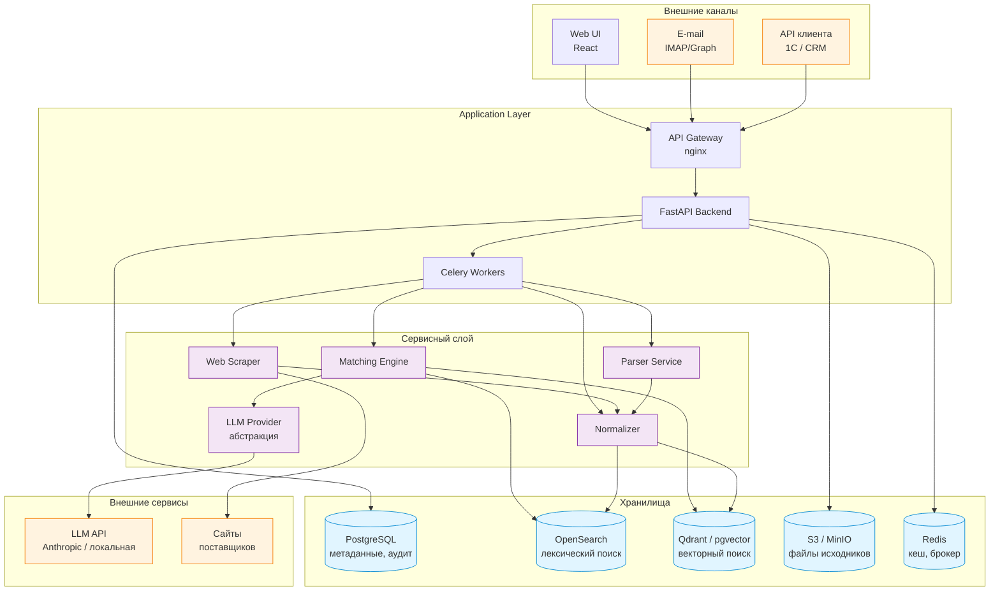

### 7.3. Поток данных: обработка одной спецификации

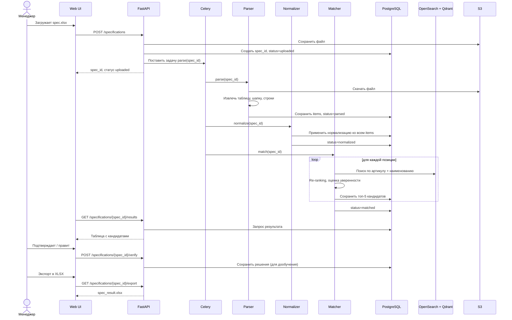

### 7.4. Жизненный цикл спецификации

Каждая спецификация проходит через явные статусы. Это базис для observability и для пользовательского интерфейса (вкладка «В работе» / «На проверке» / «Готово»).

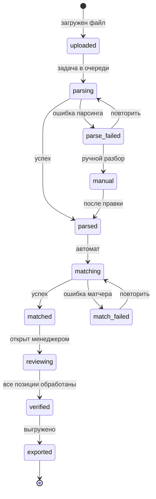

### 7.5. Что меняется между Фазой 1 и Фазой 2

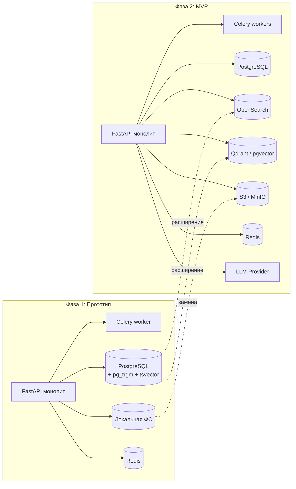

Ключевые отличия:

- **Хранилище файлов:** локальная ФС → S3-совместимое.
- **Поиск:** PostgreSQL `pg_trgm`/`tsvector` → OpenSearch + векторная БД.
- **LLM:** отсутствует → через абстракцию `LLMProvider`.
- **Парсеры:** только XLSX/CSV → все форматы + OCR + веб-парсинг.

Архитектура монолита (FastAPI + Celery) **не меняется**. Микросервисы на этом масштабе — преждевременная оптимизация.

---

## 8. Модель данных

### 8.1. Ключевые сущности

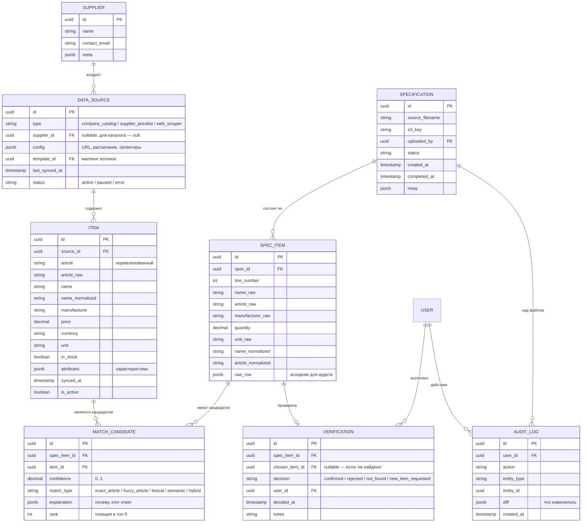

### 8.2. Решение «единая таблица ITEM»

Принципиальное решение: позиции каталога компании и позиции из прайсов поставщиков лежат **в одной таблице** `ITEM`. Различаются только полем `source_id` → `DATA_SOURCE.type`.

**Почему это правильно:**

- Matching Engine выполняет один тип поиска вне зависимости от источника. Дублирующая логика «искать в каталоге» и «искать в прайсах» — лишний код и расхождения в нормализации.
- Один поисковый индекс вместо двух. Запросы «топ-5 кандидатов» отрабатывают за один поход в OpenSearch.
- Веб-скрапинг (Фаза 2) включается тривиально: появляется ещё один `DATA_SOURCE.type='web_scraper'`, новых таблиц не нужно.

**Чем расплачиваемся:**

- Запросы «только товары моей компании» — фильтр по `source_id.type='company_catalog'`. Индексируется, проблемой не является.
- Права доступа сложнее: менеджер видит позиции каталога свободно, но прайсы только разрешённых поставщиков. Решается через RLS и/или фильтр в репозитории.

### 8.3. Что закладывается в Фазе 1

Из всей модели в прототипе реализуются:

- `DATA_SOURCE` (с полем `type` — закладываем сразу, это копеечный объём работы, но критичный для Фазы 2).
- `SUPPLIER` — минимально.
- `ITEM` — основная таблица.
- `SPECIFICATION` и `SPEC_ITEM`.
- `MATCH_CANDIDATE`.

`VERIFICATION` в прототипе — упрощённая (запись факта, без полноценного RBAC).
`AUDIT_LOG` — добавляется в Фазе 2.

### 8.4. Стратегия миграций

С первого дня — **Alembic**. Никаких ручных правок схемы. Это правило не обсуждается: оно стоит 30 минут на старте и экономит дни через несколько месяцев.

Каждая миграция:
- Имеет внятное имя (`002_add_data_source_config_field.py`, не `auto.py`).
- Реверсивна (`downgrade` написан и протестирован).
- Не содержит DML, кроме случаев, когда это явно необходимо (заполнение нового поля).

---

## 9. Matching Engine — ядро системы

### 9.1. Многоуровневая стратегия

Матчер работает каскадом: от самых дешёвых и однозначных совпадений к самым дорогим и неточным. Каждый уровень добавляет кандидатов в общий пул, после чего идёт финальный re-ranking.

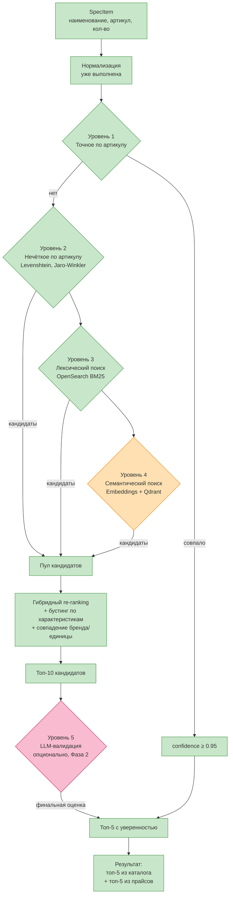

| Уровень | Метод | Фаза | Стоимость | Точность |
|---|---|---|---|---|
| 1. Точное по артикулу | После нормализации артикула — прямой ключевой поиск | 1 | ~1 мс | Очень высокая (0.95+) |
| 2. Нечёткое по артикулу | Levenshtein + Jaro-Winkler через `rapidfuzz` | 1 | ~10 мс | Высокая (0.8–0.95) — ловит опечатки |
| 3. Лексический по наименованию | OpenSearch BM25 (Фаза 2) / `pg_trgm`+`tsvector` (Фаза 1) | 1+2 | ~30 мс | Средняя (0.5–0.8) |
| 4. Семантический | Эмбеддинги через multilingual-e5-large или bge-m3, поиск в Qdrant/pgvector | 2 | ~50 мс | Средняя–высокая, ловит синонимы |
| 5. LLM-валидация | Claude / OpenAI / локальная модель: «является ли X тем же товаром, что Y?» | 2 (опционально) | ~500–2000 мс на пачку | Высокая, но дорого |

### 9.2. Гибридный re-ranking

После сбора кандидатов с уровней 1–4 идёт пересортировка. Финальная оценка — взвешенная сумма:

```
final_score =
    w_article × article_similarity +
    w_lexical × bm25_score +
    w_semantic × cosine_similarity +
    boost_brand × brand_match +
    boost_unit × unit_match +
    boost_attrs × attributes_match
```

Веса (`w_*`) и бусты — начальные значения подбираются экспертно, далее настраиваются на золотом датасете. В Фазе 2 — возможность обучить ML-ранкер (LightGBM на парах «правильный/неправильный кандидат»).

### 9.3. Объяснимость

Для каждого кандидата матчер возвращает `explanation`:

```json
{
  "article_match": "exact_after_normalization",
  "article_similarity": 1.0,
  "lexical_score": 0.62,
  "semantic_similarity": 0.87,
  "brand_match": true,
  "unit_match": true,
  "final_score": 0.91,
  "human_readable": "Артикул совпал точно, бренд и единица измерения тоже"
}
```

Это отображается в UI при наведении на оценку уверенности. Без объяснимости менеджеры либо тратят минуты на проверку каждого высокоуверенного совпадения, либо подтверждают вслепую — оба варианта плохие.

### 9.4. Абстракция LLM-провайдера

LLM в матчере (уровень 5) — опциональный путь, не критичный для качества. Архитектурно он спрятан за интерфейсом:

```python
class LLMProvider(Protocol):
    async def compare(
        self,
        spec_item: SpecItem,
        candidates: list[Item],
    ) -> list[LLMVerdict]: ...
```

Реализации:

- `AnthropicProvider` — API claude.com
- `OpenAIProvider` — API openai.com
- `LocalLlamaProvider` — локальная модель (Qwen, Llama) на GPU через vLLM или Ollama
- `NoOpProvider` — пустая реализация для случаев, когда LLM не используется

Выбор провайдера — через конфиг. Связано с открытым пунктом A4: пока решение по внешним LLM не принято, в проде включён `NoOpProvider`, разработка ведётся с `AnthropicProvider` в dev-окружении.

### 9.5. Накопление обратной связи (active learning)

Каждое решение менеджера в UI верификации сохраняется в `VERIFICATION`. Эти данные — основа для:

1. **Перенастройки весов re-ranker'а** — раз в месяц или после накопления N решений. Цель: повысить долю правильных ответов в топ-1.
2. **Расширения словаря синонимов** — если менеджер регулярно выбирает «винт» там, где спецификация говорила «болт», эта пара попадает в словарь.
3. **Обучения ML-ранкера** — на парах «строка спецификации → правильный артикул». На объёмах от 5–10 тысяч пар имеет смысл обучать собственную модель ранжирования.
4. **Расширения золотого датасета** — подтверждённые матчинги пополняют золотой датасет автоматически (с проверкой на дубликаты).

Это критичная функциональность: без неё матчер «застывает» на уровне настройки разработчиком и не улучшается со временем. С ней — качество растёт ежемесячно без вмешательства разработчика.

---

## 10. Парсинг и нормализация

### 10.1. Стратегия по форматам

| Формат | Библиотека | Фаза | Особенности |
|---|---|---|---|
| XLSX | `openpyxl`, `pandas` | 1 | Основной формат — 75% потока |
| XLS (старый) | `xlrd` < 2.0 | 1 | Для совместимости |
| CSV / TSV | `pandas`, стандартный `csv` | 1 | Автоопределение разделителя и кодировки (`chardet`) |
| DOCX | `python-docx` | 2 | Извлечение таблиц + структурированный текст |
| DOC (старый) | `antiword` или конвертация через `libreoffice --headless` | 2 | Редкий, но встречается |
| DBF | `dbfread` | 2 | Из ответа A5 — попадаются в 5% случаев |
| XML | `lxml` + специфичные схемы | 2 | Обычно структурированный, парсится быстро |
| PDF текстовый | `pdfplumber`, `PyMuPDF` | 2 | Извлечение таблиц — отдельная задача |
| PDF с таблицами | `camelot-py` или `tabula-py` | 2 | Тестировать на реальных файлах |
| PDF скан / фото | **Tesseract** или **PaddleOCR** | 2 | PaddleOCR лучше для кириллицы. Альтернатива — облачные API (Google Document AI) |

### 10.2. Алгоритм определения шапки

Реальные Excel-спецификации редко начинаются с шапки на первой строке. Алгоритм:

1. Прочитать первые 30 строк листа.
2. Для каждой строки — посчитать «score шапки»: количество ячеек, содержащих ключевые слова или их синонимы («наименование», «артикул», «количество», «цена», «бренд», «производитель», «ед. изм.»).
3. Строка с максимальным score — это шапка. Если максимум меньше порога (например, 3 совпадения) — fallback на ручное указание.
4. После определения шапки — построить маппинг колонок (какая колонка под что отвечает).
5. Сохранить маппинг как **шаблон**, привязанный к источнику (email-домен отправителя, имя файла, чексумма структуры). При повторной загрузке от того же клиента — шаблон применяется автоматически.

### 10.3. Нормализация: справочники

| Что нормализуем | Метод | Источник |
|---|---|---|
| Единицы измерения | Словарь синонимов | Своя таблица + ручное пополнение |
| Производители / бренды | Словарь + NER | Своя таблица + LLM для пополнения |
| Артикул (формат) | Регулярные выражения по поставщикам | Конфиг |
| Технические характеристики | Регэкспы + NER | Spacy + кастомная модель (Фаза 2) |
| Транслитерация | Стандартная таблица RU↔EN | `transliterate` |

Все нормализованные значения хранятся **рядом с оригиналом** (`name_raw` и `name_normalized`). Это нужно и для отображения в UI «как у клиента», и для аудита.

---

## 11. Веб-парсинг (Фаза 2)

### 11.1. Зачем это нужно

Часть поставщиков не предоставляет файловых прайсов: данные доступны только на сайте. Из ответа Q4.2 — таких поставщиков «немало», то есть веб-парсинг — приоритет первой части Фазы 2, а не «когда-нибудь потом».

### 11.2. Единый интерфейс с файловыми источниками

Принцип, заложенный в раздел 8: веб-скрапер — это **источник данных того же типа**, что и файловый прайс. Различия:

| Аспект | Файловый прайс | Веб-парсер |
|---|---|---|
| Источник | Файл (XLSX/CSV) | URL сайта |
| Расписание | По загрузке файла | Cron (например, раз в сутки в 3:00) |
| Конфиг | Маппинг колонок | URL + селекторы + расписание |
| Жизненный цикл ошибок | Файл не пришёл — алерт | Сайт изменил вёрстку — алерт |
| Правовой аспект | Файл прислал поставщик — ОК | Нужно явное согласие или ToS |
| Природа ошибок парсинга | Изменилась структура файла (редко) | Изменилась вёрстка (часто) |

Архитектурно они отдельные модули — общий только выходной интерфейс: нормализованные позиции в индекс.

### 11.3. Стек веб-скрапера

| Задача | Инструмент | Когда применять |
|---|---|---|
| Статичные HTML | `httpx` + `BeautifulSoup4` | Большинство B2B-сайтов |
| JS-рендеринг | `Playwright` (Python) | Витрины на React/Vue |
| JSON-LD / schema.org | Прямой парсинг JSON | Если поставщик отдаёт разметку — использовать в первую очередь |
| Много сайтов (>10) | `Scrapy` + `scrapy-playwright` | Когда нужна очередь, middleware, throttling |
| Защищённые сайты | `curl-impersonate`, ротация прокси | Только при явном согласии поставщика |

**Перед добавлением каждого нового сайта — проверить, не отдаёт ли поставщик `products.xml` / `price.csv` / API.** В большинстве случаев — отдаёт, и это лучше скрапинга по всем параметрам.

### 11.4. Принципиальные отличия от файлового импорта

Эти особенности влияют на архитектурные решения:

**Нестабильность структуры.** Сайт меняет вёрстку без предупреждения. Митигация:

- Мониторинг здоровья: если за N подряд обходов не распозналось ни одной позиции — алерт, статус `error`, обход приостанавливается.
- Версионирование конфига: при изменении селекторов старая конфигурация сохраняется, можно откатиться.
- Тест одной страницы — обязательная кнопка в конфигураторе до сохранения скрапера.

**Правовой аспект.** Часть сайтов запрещает автоматический сбор в ToS. Чек-лист до запуска:

- Проверить ToS сайта.
- Если есть договор с поставщиком — получить письменное согласие.
- Соблюдать `robots.txt`.
- Не вызывать чрезмерную нагрузку (throttling).

**Качество данных.** Веб даёт «грязнее» данные, чем Excel. Нормализатор должен обрабатывать:

- «От 1 234 ₽», «1 234.00 руб.», «по запросу» — в `price`.
- «За уп. 50 шт», «рулон 50 м» — в `unit` + `pack_size`.
- Отсутствующие поля — частая ситуация.
- Текстовое наличие: «в наличии», «под заказ», «нет на складе» — в `in_stock`.

**Diff-детектор.** Сохранять только изменения, не перезаписывать всё. Иначе теряется история цен.

---

## 12. Поиск и индексы

### 12.1. Стратегия по фазам

| Фаза | Лексический поиск | Семантический поиск |
|---|---|---|
| Фаза 1 (прототип) | PostgreSQL `pg_trgm` + `tsvector` | Не используется |
| Фаза 2 (MVP) | OpenSearch | pgvector или Qdrant |

### 12.2. Прототип: PostgreSQL `pg_trgm` + `tsvector`

На объёмах прототипа (30К позиций каталога) PostgreSQL справится без выделенного поискового движка.

```sql
-- Включение расширений
CREATE EXTENSION pg_trgm;
CREATE EXTENSION btree_gin;

-- Индексы для нечёткого поиска по артикулу
CREATE INDEX idx_item_article_trgm ON item USING gin (article_normalized gin_trgm_ops);

-- Полнотекстовый поиск по наименованию
ALTER TABLE item ADD COLUMN name_tsv tsvector
    GENERATED ALWAYS AS (to_tsvector('russian', coalesce(name_normalized, ''))) STORED;
CREATE INDEX idx_item_name_tsv ON item USING gin (name_tsv);
```

Это даёт:
- Нечёткий поиск по артикулу через `similarity(article_normalized, $1) > 0.7` или `% оператор`.
- Полнотекстовый поиск по наименованию через `name_tsv @@ to_tsquery('russian', $1)`.
- Ранжирование через `ts_rank()`.

Время отклика на этих объёмах — десятки миллисекунд. Этого хватает для прототипа.

### 12.3. MVP: OpenSearch

На 250–300К позиций PostgreSQL начинает деградировать на сложных запросах. OpenSearch (форк Elasticsearch с лицензией Apache 2.0) даёт:

- Полнотекстовый поиск с BM25 — лучше, чем `ts_rank`, по качеству ранжирования.
- Гибкие анализаторы для русского языка (морфология, синонимы).
- Phrase matching, fuzzy queries, бустинг по полям из коробки.
- Горизонтальное масштабирование, если потребуется.

Индекс структурируется так:

```json
{
  "item_id": "uuid",
  "source_id": "uuid",
  "source_type": "company_catalog | supplier_pricelist | web_scraper",
  "article_raw": "M10*40",
  "article_normalized": "M1040",
  "name_raw": "Болт М10х40 оцинков. DIN933",
  "name_normalized": "болт м10х40 оцинкованный din933",
  "manufacturer": "не указан",
  "manufacturer_normalized": "noname",
  "attributes": {
    "diameter_mm": 10,
    "length_mm": 40,
    "standard": "DIN 933",
    "coating": "оцинковка"
  },
  "price": 12.5,
  "currency": "RUB",
  "unit": "pcs",
  "in_stock": true,
  "is_active": true,
  "indexed_at": "2026-05-26T10:00:00Z"
}
```

### 12.4. MVP: векторный поиск

Выбор между pgvector и Qdrant:

| Критерий | pgvector | Qdrant |
|---|---|---|
| Простота инфраструктуры | ✅ — внутри PostgreSQL | ❌ — отдельный сервис |
| Производительность на 300К | Достаточно | Лучше |
| Сложные фильтры (по бренду, единице) | Через JOIN с PostgreSQL | Из коробки |
| Квантование (int8, binary) | Базовое | Зрелое |
| Распределённость | Через шардирование PostgreSQL | Из коробки |

**Рекомендация:** старт Фазы 2 — на **pgvector**. Это минимум новой инфраструктуры и достаточная производительность на наших объёмах. Переход на **Qdrant** — если упрёмся в производительность или захотим сложные фильтры. Архитектура (раздел 7.1) это позволяет: поиск спрятан за репозиторием.

### 12.5. Эмбеддинги

Модель для мультиязычных эмбеддингов:

- **Стартовая:** `intfloat/multilingual-e5-large` или `BAAI/bge-m3`. Обе мультиязычные, обе работают на русском.
- **Размер вектора:** 1024 (e5-large) или 1024 (bge-m3).
- **Источник:** Hugging Face, можно крутить локально через `sentence-transformers` или вызывать API.

В Фазе 2.5 — fine-tune собственной модели на доменных данных, когда накопится 50К+ примеров из реальной разметки.

**Инкрементальные обновления:**

- Новая позиция в каталоге → задача в очереди → сгенерировать эмбеддинг → положить в индекс.
- Изменилось имя/атрибуты → пересчёт только этой позиции.
- Полный пересчёт — только при смене модели эмбеддингов, и это запланированная операция, не ежедневная.

### 12.6. Контракт репозитория поиска

Поиск спрятан за единым интерфейсом. Бизнес-логика не знает, кто реализует поиск.

```python
class SearchRepository(Protocol):
    async def search_by_article(
        self,
        article: str,
        source_filter: SourceFilter | None = None,
        limit: int = 10,
    ) -> list[SearchHit]: ...

    async def search_lexical(
        self,
        query: str,
        source_filter: SourceFilter | None = None,
        limit: int = 10,
    ) -> list[SearchHit]: ...

    async def search_semantic(
        self,
        embedding: list[float],
        source_filter: SourceFilter | None = None,
        limit: int = 10,
    ) -> list[SearchHit]: ...

    async def search_hybrid(
        self,
        query: str,
        embedding: list[float] | None = None,
        source_filter: SourceFilter | None = None,
        limit: int = 10,
    ) -> list[SearchHit]: ...
```

Реализации:
- `PgTrgmSearchRepository` — Фаза 1.
- `OpenSearchRepository` + `PgVectorRepository` — Фаза 2.
- `OpenSearchRepository` + `QdrantRepository` — при переходе на Qdrant.

Замена реализации — точечная, бизнес-логика не меняется.

---

# Часть IV. Технологический стек

## 13. Стек по слоям

Решения по стеку приняты с расчётом на **внутреннюю команду** и **6-месячный горизонт MVP**. Приоритеты при выборе технологии: зрелость экосистемы, доступность специалистов на рынке, скорость онбординга, минимизация эксплуатационных рисков.

### 13.1. Backend и приложение

| Назначение | Технология | Версия | Обоснование |
|---|---|---|---|
| Язык | Python | 3.12+ | Лучшая экосистема для парсинга, ML, OCR. Альтернатива (Go/Java) — формально допустима, но потеряем готовые ML-библиотеки |
| Веб-фреймворк | FastAPI | 0.110+ | Асинхронный, автогенерация OpenAPI-спеки, активная экосистема. Альтернативы (Litestar, Django REST) — допустимы, но выигрыш не оправдан |
| ASGI-сервер | Uvicorn + Gunicorn | свежие | Стандарт для FastAPI в проде |
| ORM | SQLAlchemy 2.0 | 2.0+ | Зрелый стандарт. Альтернатива (Tortoise, SQLModel) — менее зрелые в части миграций и сложных запросов |
| Миграции | Alembic | свежие | Идёт с SQLAlchemy |
| Валидация | Pydantic v2 | 2.5+ | Идёт с FastAPI, обязательная связка |
| Очередь задач | Celery | 5.3+ | Стандарт. Альтернатива — Dramatiq (проще, но меньше экосистема). Целесообразно с Фазы 1 |
| HTTP-клиент | httpx | свежий | Async-нативный, замена requests |

**Почему не «модный async стек»** (Starlette + Tortoise + Dramatiq и т.п.):

Внутренней команде нужен предсказуемый стек, по которому есть много специалистов на рынке и Stack Overflow ответ на любой вопрос. Эксперименты с менее популярными библиотеками — это потеря времени на обучение и риск встать на странной проблеме в проде. На горизонте 6 месяцев это критично.

### 13.2. Парсинг файлов

| Формат | Библиотека | Лицензия |
|---|---|---|
| XLSX | `openpyxl` | MIT |
| XLS (старый) | `xlrd` < 2.0 | BSD |
| CSV | `pandas` + стандартный `csv` | BSD |
| Определение кодировки | `chardet` | LGPL |
| DOCX | `python-docx` | MIT |
| PDF текст | `pdfplumber` (на базе pdfminer) | MIT |
| PDF таблицы | `camelot-py[cv]` | MIT |
| OCR | `paddleocr` или `pytesseract` | Apache 2.0 / Apache 2.0 |
| DBF | `dbfread` | MIT |
| XML | `lxml` | BSD-style |
| E-mail | `mail-parser`, `extract-msg` | MIT / BSD |

### 13.3. Поиск и матчинг

| Назначение | Технология |
|---|---|
| Лексический поиск (Фаза 1) | PostgreSQL `pg_trgm` + `tsvector` |
| Лексический поиск (Фаза 2) | **OpenSearch** 2.11+ |
| Векторный поиск (Фаза 2) | **pgvector** старт → **Qdrant** при необходимости |
| Fuzzy matching строк | `rapidfuzz` (быстрый аналог fuzzywuzzy) |
| Эмбеддинги | `sentence-transformers` + `intfloat/multilingual-e5-large` или `BAAI/bge-m3` |
| LLM-провайдеры | Anthropic SDK, OpenAI SDK, vLLM/Ollama для локальной |
| NER | `spacy` + русская модель `ru_core_news_lg` |

### 13.4. Хранилище

| Тип данных | Решение | Версия |
|---|---|---|
| Реляционные данные | **PostgreSQL** | 16 |
| Лексический индекс | **OpenSearch** | 2.11+ (Фаза 2) |
| Векторы | **pgvector** (внутри PostgreSQL) или **Qdrant** | свежие |
| Файлы | **S3-совместимое**: AWS S3 / Yandex Object Storage / MinIO (on-prem) | — |
| Кеш и брокер | **Redis** | 7+ |

### 13.5. Frontend

| Назначение | Технология |
|---|---|
| Фреймворк | **React 18 + TypeScript**, сборка через **Vite** |
| Роутинг | React Router |
| UI-kit | **Tailwind CSS** + **shadcn/ui** для базовых компонентов. Для сложных таблиц — **TanStack Table** |
| Server state | **TanStack Query** |
| Client state | **Zustand** для глобального, локальный — встроенный |
| Формы | **React Hook Form** + Zod |
| Графики (для дашборда) | **Recharts** |

В Фазе 1 — минимум зависимостей, никаких сложных UI-фреймворков. Достаточно простого приложения на React + Tailwind. shadcn/ui добавляем сразу — он не «фреймворк», а копипаста компонентов под Tailwind.

### 13.6. DevOps и инфраструктура

| Назначение | Технология | Фаза |
|---|---|---|
| Контейнеризация | **Docker + Docker Compose** | 1+2 |
| Оркестрация | Docker Compose (1+ ранний 2) → **Kubernetes** при необходимости горизонтального масштабирования | 2 (опционально) |
| CI/CD | **GitLab CI** или **GitHub Actions** в зависимости от того, где репозиторий | 1+ |
| IaC | **Terraform** (если облако с управляемыми сервисами) | 2 |
| Мониторинг | **Prometheus + Grafana** | 2 |
| Логи | **Loki + Grafana** | 2 |
| Трейсинг | **OpenTelemetry + Jaeger** | 2 |
| Секреты | Vault или встроенные секреты K8s / переменные окружения | 1+ |

### 13.7. Тестирование

| Слой | Инструмент |
|---|---|
| Backend unit / integration | `pytest` + `pytest-asyncio` |
| Backend test database | testcontainers с PostgreSQL |
| Frontend unit | `Vitest` |
| E2E | `Playwright` |
| Регрессия матчера | **Прогон по золотому датасету** на каждый PR в matching engine |
| Производительность | `locust` для нагрузочных тестов (Фаза 2) |

---

## 14. Обоснование ключевых выборов

Решения, которые могут вызвать вопросы — отдельно с обоснованием.

### 14.1. Почему монолит, а не микросервисы

Микросервисная архитектура на горизонте 6 месяцев и команде уровня одной комнаты — почти всегда преждевременная оптимизация. Аргументы:

- Декомпозиция на сервисы преждевременна, пока неизвестны реальные границы доменов. На прототипе мы их только нащупываем.
- Каждый новый сервис — это новая граница сетевого вызова, новая возможность сбоя, новая необходимость следить за обратной совместимостью контрактов.
- Эксплуатация микросервисов требует зрелого DevOps. У нас он есть на горизонте, но не «с первого дня».

Монолит с хорошей внутренней модульностью (сервисный слой за интерфейсами, отдельные пакеты под парсинг, нормализацию, матчинг) — даёт 90% преимуществ микросервисов без их минусов. При необходимости в будущем — выделение модуля в сервис делается за неделю.

### 14.2. Почему PostgreSQL+pg_trgm в Фазе 1, а не сразу OpenSearch

Прототип отвечает на вопрос «работает ли матчинг», а не «выдерживает ли поиск 300К позиций». На объёмах прототипа (30К каталога) PostgreSQL — это:

- Минус один сервис в инфраструктуре.
- Минус одна тема, в которой команде нужно разбираться на старте.
- Минус сложность с синхронизацией данных между БД и индексом.

При этом архитектура (репозиторий поиска за интерфейсом, раздел 12.6) позволяет добавить OpenSearch в Фазе 2 точечно. Преждевременное добавление OpenSearch на прототип — это 1–2 недели на «разобраться и поднять», которые мы предпочитаем потратить на собственно матчинг.

### 14.3. Почему OpenSearch, а не Elasticsearch

С 2021 года Elasticsearch изменил лицензию на SSPL, что делает его неудобным для коммерческих продуктов и on-premise развёртываний. OpenSearch — форк Amazon под лицензией Apache 2.0, API совместим с Elasticsearch 7.10, активно развивается, нет лицензионных рисков.

### 14.4. Почему pgvector сначала, потом Qdrant

pgvector — это расширение PostgreSQL. Плюсы:
- Один сервис вместо двух.
- Транзакционная согласованность с основной БД.
- Гибкие фильтры через SQL.

Минусы:
- На очень больших объёмах (миллионы векторов) — деградация производительности.
- Менее зрелые алгоритмы индексации, чем у специализированных решений.

На наших 250–300К позиций pgvector — оптимальный выбор. Qdrant — заготовка на случай роста.

### 14.5. Почему Celery, а не Dramatiq / Arq / встроенные таски FastAPI

- **Встроенные `BackgroundTasks` FastAPI** — не настоящая очередь, задачи теряются при перезапуске. Не подходит.
- **Dramatiq** — проще Celery, но экосистема меньше. На команду без опыта Dramatiq — потеря времени.
- **Arq** — async-нативный, но менее зрелый.
- **Celery** — стандарт с богатой экосистемой, поддержкой расписаний (Celery Beat), мониторинга (Flower), retries, и т. д. Знакомый каждому Python-разработчику.

### 14.6. Почему React, а не Vue / Svelte / Next.js

- **React + Vite (SPA)** — большинство специалистов на рынке знают React. Vite даёт мгновенный dev-сервер. Этого хватает.
- **Next.js** — нужен SSR. У нас приложение за авторизацией, SSR не критичен. Лишняя сложность.
- **Vue/Svelte** — допустимы, но если команда знает их хуже React, выбор очевиден.

### 14.7. Почему не Django

Django мог бы быть выбором — он даёт админку из коробки, ORM, миграции. Но:
- Async-поддержка в Django всё ещё «вторичная», тогда как FastAPI — async-native.
- Для API-first продукта Django + DRF — это два слоя абстракций, FastAPI — один.
- Админка из коробки полезна, но `sqladmin` для FastAPI закрывает 80% потребности.

Для проекта, где API важнее, чем встроенный CRUD, FastAPI выигрывает.

---

# Часть V. План разработки

## 15. Фаза 0 — подготовка данных

Этот блок работ выполняется **силами заказчика параллельно с поиском команды**. Без него Фаза 1 не стартует. Все пункты — необходимые, не желательные.

> **Примечание о датах.** Конкретные даты в Gantt-диаграммах (здесь и далее в разделах 16, 17) — иллюстративные, отсчитываются от условного старта Фазы 0 в начале июня 2026. При реальном старте сдвигаются на нужное число дней. Важна не привязка к календарю, а **продолжительность этапов** и их **последовательность**.

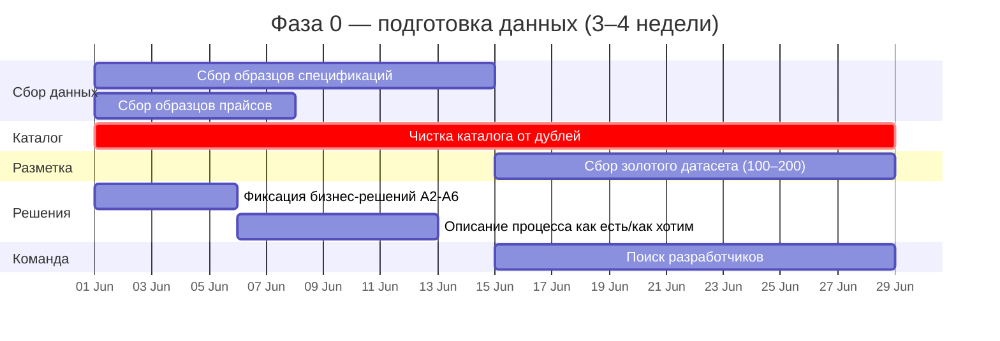

### 15.1. Сбор образцов входящих спецификаций

- 25–30 реальных файлов из переписки менеджеров.
- Максимально разные: аккуратные Excel, кривые с объединёнными ячейками, файлы из мессенджеров.
- Для каждого пометить формат, насколько типичен, какой клиент прислал.

Это главный актив. Без реальных файлов парсер делается «вслепую» и переделывается потом.

### 15.2. Сбор образцов прайсов поставщиков

- 5–10 прайсов от разных поставщиков.
- Максимально разной структуры.
- Отметить: частота обновления, валюта, способ доставки (почта/портал/FTP).

### 15.3. Чистка каталога компании — критичный трек

Каталог 30К позиций сейчас в CSV, выгружен из 1С, **не очищен от дубликатов** (по A6). Ответственный — Пинигина О.В. (НСО).

Что нужно сделать **до прогона по золотому датасету**:

- Выгрузить полный каталог.
- Дедуплицировать (можно с помощью того же `rapidfuzz` — простой скрипт, разработчик прототипа может помочь).
- Слить дубликаты, оставив «канонические» позиции.
- Проверить заполненность артикулов, единообразие единиц измерения.
- Удалить очевидно «мусорные» строки.

**Почему это критично:** грязный каталог → матчер показывает дубликаты как разные результаты → точность визуально низкая, даже если алгоритм идеален. Это испортит цифру по золотому датасету и приведёт к ложному отрицательному решению о гипотезе.

### 15.4. Сбор «золотого датасета»

100–200 строк из реальных спецификаций, для каждой вручную проставить правильный артикул каталога. Заполнять прямо в `gold_dataset_template.xlsx`.

Это инструмент:
1. Измерения качества матчера в цифрах.
2. Принятия решения о Фазе 2.
3. Регрессионного тестирования на протяжении всей жизни продукта.

### 15.5. Фиксация бизнес-решений

Опросник `05_business_decisions_questionnaire.md` уже заполнен по блоку A. Остаются открытыми:

- **A4** — внешние LLM (нужно согласование со СБ).
- **B2, B3** — валюты, налоги, единицы измерения (детали).
- **B5** — окончательное решение по SaaS / multi-tenancy.
- **C1, C2** — приоритет интеграций.

Срок закрытия: A4 — до старта Фазы 2. Остальное — на протяжении Фазы 2.

### 15.6. Критерии готовности к Фазе 1

- [ ] Собрано ≥ 25 реальных спецификаций.
- [ ] Собрано ≥ 5 реальных прайсов поставщиков.
- [ ] Каталог очищен от дубликатов (завершено или близко к завершению).
- [ ] Золотой датасет заполнен на ≥ 100 строк.
- [ ] Закрыты пункты A1, A2, A3, A5, A6 опросника.
- [ ] Подобран Python-разработчик (или выделен из внутренней команды).
- [ ] Поднята тестовая инфраструктура (VPS).

---

## 16. Фаза 1 — прототип

### 16.1. Цель

**Получить цифру точности матчинга на золотом датасете** и принять решение о Фазе 2. Прототип — не продукт.

### 16.2. Состав работ

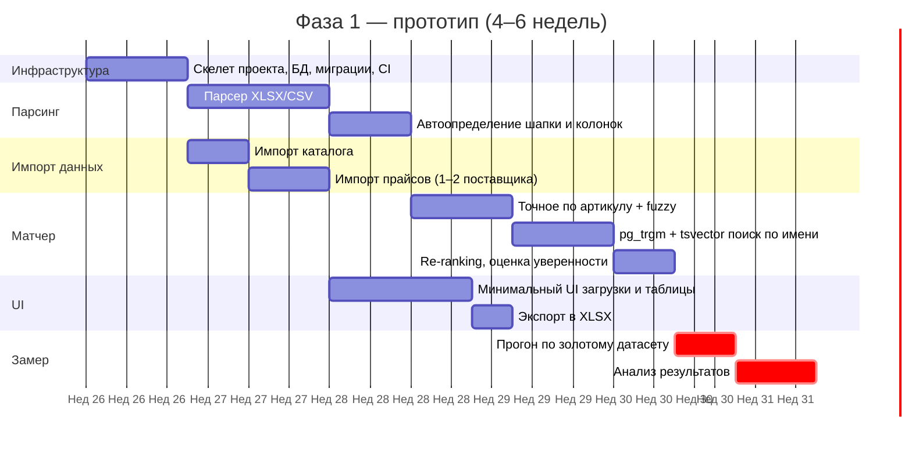

### 16.3. Что входит в прототип

Жёсткий минимум:

1. **Скелет приложения:** FastAPI, PostgreSQL с pg_trgm и tsvector, Celery + Redis (даже если задач мало — это закладка инфраструктуры), Docker Compose, миграции Alembic.

2. **Импорт каталога:** загрузка CSV/XLSX по фиксированному шаблону колонок (без автодетекции для каталога). Валидация: пустые наименования, дубли артикулов — выводить списком, не падать.

3. **Импорт прайсов поставщиков:** для 1–3 поставщиков, по предварительно настроенным шаблонам колонок. Сохранение в общую таблицу `ITEM` с правильным `source_id`.

4. **Парсер входящих спецификаций:** XLSX, XLS, CSV. Извлечение полей, описанных в 4.1.3. Устойчивость к шапке не на первой строке, объединённым ячейкам, разному порядку колонок. Fallback на ручной маппинг колонок.

5. **Матчер:** двухуровневый — точное и нечёткое совпадение по артикулу (`rapidfuzz`), полнотекстовый и нечёткий поиск по наименованию (`pg_trgm` + `tsvector`). Возвращает топ-5 кандидатов из каталога и топ-5 из прайсов с оценкой уверенности.

6. **UI:** загрузка файла → таблица «исходная позиция → кандидаты» → ручная коррекция → выгрузка в XLSX. Дизайн не приоритет.

7. **Режим прогона по золотому датасету:** обрабатывает все строки датасета, заполняет колонки `Результат матчера: артикул`, `Результат матчера: уверенность`, `Совпало? (да/нет)` прямо в шаблоне.

8. **Закладки для Фазы 2:**
   - Поле `DATA_SOURCE.type` в схеме БД — обязательно (раздел 8.3).
   - Сервисный слой за интерфейсами (репозиторий поиска, парсер, нормализатор) — даже если в прототипе единственная реализация.

### 16.4. Что НЕ входит в прототип (намеренно)

Чтобы уложиться в 4–6 недель работы одного разработчика:

- PDF, DOCX, OCR, распознавание сканов.
- Векторный (семантический) поиск.
- LLM-валидация.
- Авторизация, пользователи, роли — но базовый login есть как заглушка.
- Мультитенантность.
- Автодетекция структуры прайсов без шаблона.
- Интеграции (1С, ERP, e-mail).
- Автоматическая загрузка прайсов по расписанию.
- История версий, аналитика, дашборды.
- Генерация коммерческого предложения.
- Веб-парсинг (только закладка поля `data_source.type`).
- Аудит-журнал в полном виде.

Если что-то из этого «очень хочется» — это сигнал размытия границ MVP. Решение принимается осознанно, с явным пониманием влияния на срок.

### 16.5. Критерии приёмки прототипа

Прототип принят, когда выполнены **функциональные** критерии:

- [ ] Каталог и прайсы загружаются из Excel/CSV.
- [ ] Спецификация XLSX/CSV парсится, поля извлекаются корректно для ≥ 80% строк.
- [ ] Матчер возвращает топ-5 кандидатов с уверенностью.
- [ ] UI позволяет ручную верификацию.
- [ ] Результат выгружается в XLSX.
- [ ] Выполнен прогон по золотому датасету, получена цифра точности.
- [ ] Минимальный UI работает и подходит для демонстрации руководству (по Q5.2).

**Сам по себе процент точности — НЕ критерий приёмки.** Прототип принят, даже если точность низкая. Это валидный результат эксперимента.

### 16.6. Точка принятия решения

Бизнес-решение по результатам прототипа:

| Recall@5 на золотом датасете | Решение |
|---|---|
| ≥ 60% | Гипотеза подтверждена. Старт Фазы 2 |
| 40–60% | 1–2 недели итераций матчера (нормализация, словари, веса). Повторный замер. |
| < 40% | Пересмотр подхода или закрытие проекта |

Решение принимает заказчик, разработчик готовит:
- Цифру точности.
- Разбор ошибок матчинга (категории, что не сработало).
- Оценку, какие улучшения дадут наибольший выигрыш.

---

## 17. Фаза 2 — MVP

### 17.1. Общий план

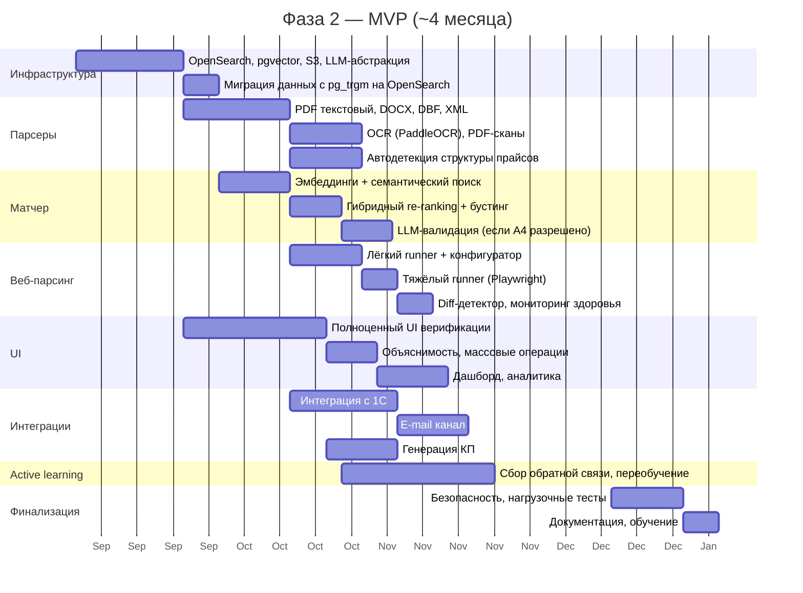

### 17.2. Этапы

**Этап 2.1. Инфраструктура (3 недели)**

Подключение OpenSearch и pgvector, S3-совместимое хранилище, абстракция LLM-провайдера. Миграция данных из PostgreSQL `pg_trgm` в OpenSearch. После этого матчер работает на новом стеке.

**Этап 2.2. Расширение парсеров (4 недели)**

PDF текстовый, DOCX, DBF, XML — параллельно. OCR для PDF-сканов — отдельной задачей, выбор между PaddleOCR (лучше для кириллицы) и Tesseract. Автодетекция структуры прайсов без шаблона.

**Этап 2.3. Продвинутый матчинг (5 недель)**

Эмбеддинги, семантический поиск, гибридный re-ranking, бустинг по характеристикам и бренду. LLM-валидация для топ-кандидатов — **если по A4 разрешены внешние LLM или подготовлена локальная модель**.

**Этап 2.4. Веб-парсинг (4 недели)**

Конфигуратор веб-скраперов, лёгкий и тяжёлый runners, diff-детектор, мониторинг здоровья. Запуск на 2–3 пилотных сайтах поставщиков.

**Этап 2.5. UI верификации и аналитика (6 недель, параллельно с 2.2–2.4)**

Полноценный UI верификации с объяснимостью оценок уверенности, массовыми операциями. Дашборд для руководителя с метриками.

**Этап 2.6. Интеграции (5 недель)**

Интеграция с 1С — приоритет 1. E-mail канал для приёма спецификаций. Генерация КП по фирменному шаблону.

**Этап 2.7. Active learning (постоянно с Этапа 2.3)**

Сбор обратной связи от менеджеров, периодическое переобучение ранкера, пополнение словарей синонимов и аналогов.

**Этап 2.8. Финализация (2–3 недели)**

Hardening безопасности, нагрузочные тесты, аудит, документация для пользователей и админов, обучение менеджеров.

### 17.3. Критерии приёмки MVP

**Функциональные:**

- [ ] Все форматы из 4.1.2 поддержаны.
- [ ] Веб-парсинг работает на 3+ пилотных сайтах.
- [ ] UI верификации с объяснимостью оценок.
- [ ] Интеграция с 1С — рабочая, экспорт КП — рабочий.
- [ ] Дашборд с базовой аналитикой.
- [ ] Полный аудит-журнал.

**Качество:**

- [ ] Recall@5 на расширенном золотом датасете (300+ строк) ≥ 90%.
- [ ] Precision@1 ≥ 75%.
- [ ] Auto-confirm rate ≥ 40%.
- [ ] False auto-confirm rate ≤ 2%.

**Производительность:**

- [ ] Все тайминги из раздела 5.2 выдерживаются.
- [ ] Система устойчиво работает на целевых объёмах (раздел 5.1).

**Безопасность:**

- [ ] RBAC настроен и протестирован.
- [ ] Все эндпоинты — HTTPS.
- [ ] Аудит-журнал пишется и неудаляемый.
- [ ] On-premise развёртывание из той же кодовой базы — проверено в тестовой среде.

---

## 18. Команда и роли

### 18.1. Фаза 1 (прототип)

| Роль | Загрузка | Ответственность |
|---|---|---|
| Python-разработчик (full-stack) | 1.0 FTE | Весь прототип: backend, минимальный frontend, матчер, прогон |
| Заказчик / Product Owner | 0.2 FTE | Подготовка данных (Фаза 0), приёмка, точка принятия решения |
| DevOps (один из команды или внешний) | 0.1 FTE | Подъём инфраструктуры (1 VPS, Docker Compose, CI) |

### 18.2. Фаза 2 (MVP)

| Роль | Загрузка | Ответственность |
|---|---|---|
| Tech Lead / Architect | 1.0 FTE | Архитектура, code review, технические решения |
| Backend-разработчик | 1.0–2.0 FTE | Парсеры, веб-парсинг, интеграции |
| ML / Data engineer | 1.0 FTE | Матчер, эмбеддинги, fine-tuning, метрики |
| Frontend-разработчик | 1.0 FTE | UI верификации, дашборд, общая полировка |
| DevOps | 0.5 FTE | Инфраструктура, CI/CD, мониторинг |
| Product Owner / Analyst | 0.5 FTE | Приоритеты, бизнес-требования, общение с заказчиком |
| QA | 0.5–1.0 FTE | Тестирование, регрессия, нагрузочные |

### 18.3. Требования к компетенциям

**Python-разработчик прототипа:**

- Production-опыт с FastAPI или Flask/Django (если FastAPI — большой плюс).
- Уверенный PostgreSQL: SQL, индексы, расширения (хотя бы понимание).
- Опыт парсинга данных, в идеале — Excel/CSV с pandas.
- Знание основ ML — плюс, но не критично для прототипа.
- Способность быстро делать работающее, а не идеальное.

**ML/Data engineer Фазы 2:**

- Уверенный опыт с эмбеддингами и векторным поиском.
- Опыт работы с моделями Hugging Face, fine-tuning.
- Понимание метрик ранжирования (recall@k, precision@k, NDCG).
- Опыт с rapidfuzz или аналогами для fuzzy matching.

---

# Часть VI. Риски и качество

## 19. Реестр рисков

Риски разделены на три категории: технические (что-то не получится сделать или сделать достаточно хорошо), продуктовые (продукт может не дать ожидаемой ценности), организационные (проблемы с процессом или людьми).

### 19.1. Технические риски

| Риск | Вероятность | Влияние | Митигация |
|---|---|---|---|
| **Низкая точность матчинга** даже после семантического поиска и LLM | Средняя | Высокое | Фаза 1 — ранний замер. Итеративные улучшения. Fine-tune эмбеддингов на доменных данных. Возможный пивот на отраслевую специфику |
| **Грязный каталог компании** портит результаты | Высокая | Высокое | Фаза 0 — чистка от дубликатов **обязательно до прогона**. Дедупликация в самом продукте через тот же fuzzy-матчер |
| **Низкое качество входных файлов** (сканы, нестандартные структуры) | Высокая | Среднее | Постепенное расширение парсеров. Fallback на ручное указание колонок. OCR с PaddleOCR — Фаза 2 |
| **Прайсы поставщиков меняют структуру** | Средняя | Низкое | Версионирование шаблонов. Алерты при отклонении структуры |
| **Сайты поставщиков ломают парсер** при изменении вёрстки | Высокая | Среднее | Мониторинг здоровья скраперов. Версионирование конфигов. Алерты |
| **Производительность поиска** на 300К позиций | Низкая | Среднее | Переход на OpenSearch в Фазе 2 закрывает. pgvector → Qdrant как заготовка |
| **Стоимость LLM-вызовов** растёт неконтролируемо | Средняя | Среднее | Кеширование результатов. LLM только для топ-N кандидатов. Возможность отключения / локальной модели |
| **Регенерация эмбеддингов** при обновлении модели — часы | Средняя | Низкое | Инкрементальные обновления как стандарт. Полный пересчёт — плановая операция |

### 19.2. Продуктовые риски

| Риск | Вероятность | Влияние | Митигация |
|---|---|---|---|
| **Менеджеры не пользуются продуктом** даже после внедрения | Средняя | Высокое | Раннее вовлечение менеджеров — демо после прототипа, пилотная группа. Объяснимость оценок — повышает доверие |
| **Реальная экономия времени меньше заявленной** | Средняя | Среднее | Замер «до» и «после» на пилотной группе. Корректировка ожиданий |
| **Каталог компании не покрывает реальный спрос** клиентов | Высокая | Среднее | Это полезный сигнал, а не проблема: «топ ненайденных» в дашборде → задача отделу закупок расширить ассортимент |
| **Поставщики не хотят давать прайсы** для веб-парсинга | Низкая | Среднее | Файловые прайсы — основа. Веб-парсинг — дополнение. Партнёрство с поставщиками — отдельный трек |

### 19.3. Организационные риски

| Риск | Вероятность | Влияние | Митигация |
|---|---|---|---|
| **Фаза 0 затягивается** (не собираются образцы, не чистится каталог) | Высокая | Высокое | Чёткие ответственные (Пинигина О.В. за каталог). Регулярная синхронизация. Жёсткий критерий «не стартуем Фазу 1 без X» |
| **Решение по A4 (LLM)** не принимается СБ к старту Фазы 2 | Средняя | Среднее | Регулярно поднимать вопрос. Резервный план: стартуем Фазу 2 без LLM-уровня матчера, добавляем потом |
| **Уход ключевого разработчика** | Низкая | Высокое | Документация кода. Парное программирование на сложных частях. Tech lead с Фазы 2 |
| **Изменение приоритетов** заказчика, переключение команды | Средняя | Высокое | Чёткие фазы с критериями приёмки. Каждая фаза — самостоятельная ценность |

---

## 20. Тестирование и метрики качества

### 20.1. Тестовая пирамида

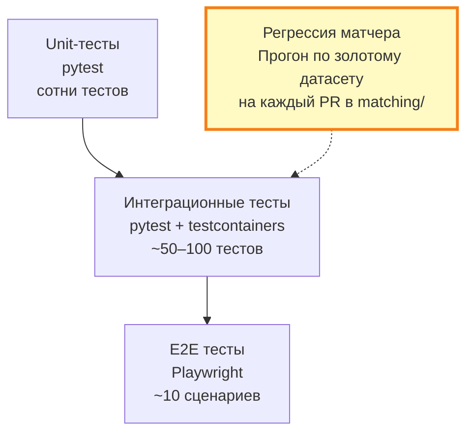

**Unit-тесты:** покрывают чистые функции — нормализация артикулов, парсинг отдельных типов ячеек, скоринг. Цель — быстрая обратная связь при разработке.

**Интеграционные тесты:** проверяют связки — «загрузил файл → распарсилось → попало в БД». Через testcontainers с реальным PostgreSQL.

**E2E тесты:** ключевые user flows через UI. Playwright. Не покрытие всего, а защита от регрессий критичных путей.

**Регрессия матчера:** при изменениях в matching engine — обязательный прогон по золотому датасету в CI. Падение метрик ниже baseline блокирует merge.

### 20.2. Метрики качества матчера

| Метрика | Что показывает | Замеряется |
|---|---|---|
| **Recall@5** | Доля строк, где правильный ответ попал в топ-5 | На каждый PR в matching/ |
| **Precision@1** | Доля строк, где первый кандидат правильный | На каждый PR |
| **Mean Reciprocal Rank** | Среднее обратное место правильного ответа | На каждый PR |
| **Auto-confirm rate** | Доля позиций с уверенностью ≥ 0.9 | Еженедельно на проде |
| **False auto-confirm rate** | Доля ошибок среди авто-подтверждений (на основе ручных правок) | Еженедельно на проде |
| **Median match time** | Время на одну позицию | Постоянно (Prometheus) |

### 20.3. Observability

| Слой | Решение | Что отслеживается |
|---|---|---|
| Метрики приложения | **Prometheus + Grafana** | RPS, латентность endpoint'ов, размер очередей, число задач в Celery |
| Бизнес-метрики | **Grafana дашборды** на основе PostgreSQL + Prometheus | KPI из 2.4, метрики матчера |
| Логи | **Loki + Grafana** | Структурированные JSON-логи, поиск по trace_id |
| Трейсинг | **OpenTelemetry + Jaeger** | Цепочка вызовов через API → Celery → БД → поиск |
| Алерты | **Alertmanager** | Падение метрик качества, рост ошибок, веб-парсеры в `error` |

### 20.4. Стратегия релизов

- **Feature branches**, merge через PR с обязательным code review.
- **CI**: на каждый PR — unit, интеграционные, регрессия матчера (если затрагивается matching/).
- **CD**: автодеплой в stage при merge в `main`. Деплой в прод — вручную через тег релиза.
- **Миграции БД** — реверсивные, обкатываются на stage, потом на проде.
- **Feature flags** для рискованных фич (новая модель матчера, новый веб-скрапер).

---

## 21. Безопасность

### 21.1. Модель угроз

Главные угрозы:

- **Утечка прайсов поставщиков** — коммерческая тайна, штрафы по договорам, потеря репутации.
- **Утечка данных клиентов** — содержимое спецификаций, контактные лица (152-ФЗ).
- **Несанкционированное изменение каталога** — может привести к ошибочным КП и финансовым потерям.
- **Атаки через загружаемые файлы** — Excel с макросами, XXE в XML, и т. п.

### 21.2. Меры

**Аутентификация и авторизация:**

- Пароли — bcrypt или argon2.
- Сессии — короткоживущие токены (15 минут) + refresh (7 дней).
- Опционально 2FA для админов.
- RBAC с ролями: менеджер, руководитель отдела, администратор, аудитор. Менеджер видит только свои спецификации и разрешённых поставщиков.

**Шифрование:**

- HTTPS на всех публичных эндпоинтах (TLS 1.2+).
- S3-бакеты с шифрованием at rest.
- Пароли БД, ключи API — через переменные окружения или Vault, не в коде.

**Защита от атак:**

- Валидация всех загружаемых файлов (тип, размер, структура) до парсинга.
- Парсеры запускаются в sandboxed окружении (отдельный контейнер с ограниченными правами).
- XML парсится с отключенным DTD (защита от XXE).
- Rate limiting на эндпоинты загрузки и API.

**Аудит:**

- Все действия над данными — в `AUDIT_LOG`.
- Журналы неизменяемые (только append).
- Возможность экспорта журналов для проверок.

### 21.3. Решение по LLM (отложено — A4)

🟡 **ТРЕБУЕТ УТОЧНЕНИЯ.** Возможные варианты:

1. **Внешние LLM разрешены** (Anthropic, OpenAI).
   - Архитектура: вызовы через `AnthropicProvider` / `OpenAIProvider`.
   - Риски: данные клиентов и прайсов уходят на сторонний сервис. Митигация: договоры о неиспользовании данных для обучения, маскирование чувствительных полей перед отправкой.

2. **Только локальная LLM.**
   - Архитектура: `LocalLlamaProvider` через vLLM или Ollama. Модель — Qwen2.5 или Llama 3.x.
   - Инфраструктура: GPU-сервер (NVIDIA A10G минимум, лучше A100). Это +$500–2000/мес к инфраструктуре облака. Для on-premise — отдельная закупка оборудования.

3. **LLM-валидация полностью отключается.**
   - Архитектура: `NoOpProvider`. Качество матчинга деградирует на ~5–15% (оценка), особенно на сложных случаях.

Решение до старта Фазы 2 — обязательно. Если решение задерживается, стартуем Фазу 2 без LLM-уровня и добавляем потом.

### 21.4. On-premise развёртывание

Для клиентов с жёсткими требованиями ИБ:

- Поставка через Docker Compose или Helm chart.
- Документированный процесс установки, бэкапа, обновления.
- Все зависимости — открытое ПО или с явными лицензионными условиями.
- Отдельная процедура поставки обновлений (не автоматическая, как в облаке).

---

# Часть VII. Приложения

## Приложение A. Глоссарий

| Термин | Определение |
|---|---|
| **Спецификация** | Входящий документ от клиента со списком товаров для закупки. XLSX/PDF/DOC/др. |
| **Позиция спецификации** (SpecItem) | Одна строка из спецификации: товар, который клиент хочет получить |
| **Каталог компании** | Собственный товарный справочник компании-дистрибьютора (источник истины) |
| **Прайс поставщика** | Список товаров с ценами от внешнего поставщика |
| **Источник данных** (DataSource) | Обобщённое понятие: каталог, прайс или веб-скрапер |
| **Позиция** (Item) | Запись о товаре из любого источника. Каталог и прайсы — это всё items, отличаются source_id |
| **Матчинг** | Процесс сопоставления позиции спецификации с позициями в каталоге и прайсах |
| **Кандидат** (MatchCandidate) | Один из возможных ответов матчера для строки спецификации |
| **Уверенность** (confidence) | Число от 0 до 1, показывающее, насколько матчер уверен в кандидате |
| **Авто-подтверждение** | Кандидат с уверенностью ≥ 0.9 — принимается без ручной проверки |
| **Recall@K** | Доля случаев, когда правильный ответ попал в топ-K кандидатов |
| **Precision@1** | Доля случаев, когда первый кандидат — правильный |
| **Золотой датасет** | Размеченный вручную набор пар «строка спецификации → правильная позиция каталога», эталон для измерения качества |
| **Active learning** | Использование ручных правок менеджеров для дообучения матчера |
| **Эмбеддинг** | Векторное представление текста, позволяющее сравнивать тексты по смыслу |
| **Семантический поиск** | Поиск по смыслу через сравнение эмбеддингов |
| **Лексический поиск** | Поиск по словам (BM25, tf-idf) |
| **Гибридный re-ranking** | Финальная сортировка кандидатов с учётом всех источников оценки |
| **Multi-tenancy** | Архитектура, позволяющая одной установке обслуживать несколько изолированных компаний |
| **RBAC** | Role-Based Access Control — управление правами доступа через роли |
| **RLS** | Row-Level Security в PostgreSQL — фильтрация строк на уровне БД по правам |
| **IDP** | Intelligent Document Processing — класс продуктов для извлечения данных из документов |

---

## Приложение B. Сводная схема архитектуры

### Развёртывание в облаке (Фаза 2)

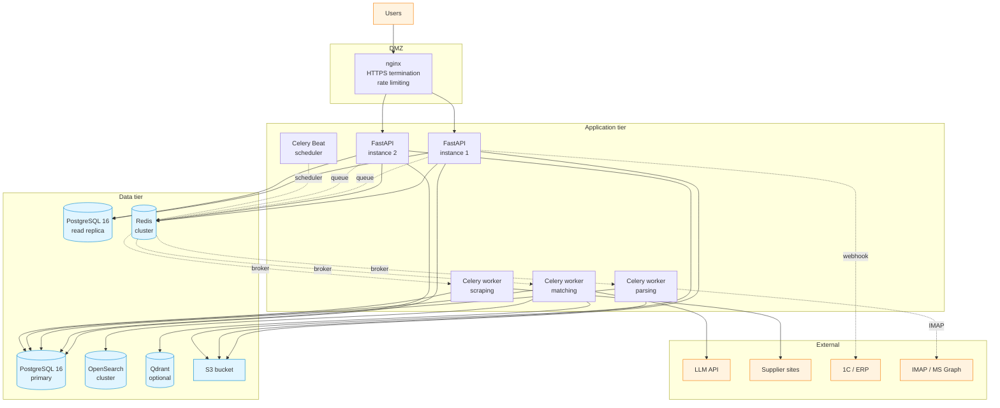

---

## Приложение C. Шаблоны и форматы

### C.1. Формат каталога компании

Файл XLSX или CSV. Колонки:

| Колонка | Тип | Обяз. | Пример | Примечание |
|---|---|---|---|---|
| `article` | string | ✅ | `BLT-M10-040-ZN` | Уникальный артикул |
| `name` | string | ✅ | `Болт М10х40 DIN 933 оцинкованный` | Полное наименование |
| `manufacturer` | string | | `KOELNER` | Производитель |
| `category` | string | | `Крепёж/Болты` | Категория (если есть) |
| `unit` | string | ✅ | `шт` | Единица измерения |
| `price` | decimal | | `12.5` | Цена компании (если есть) |
| `attributes` | json или столбцы | | `{"diameter_mm": 10}` | Технические характеристики |

### C.2. Формат прайса поставщика

Тот же формат, что и каталог. При импорте поставщика — указывается `supplier_id` и заводится `template_id` с маппингом колонок.

### C.3. Структура золотого датасета

Файл `gold_dataset_template.xlsx` (приложен). Листы:

**Лист «Инструкция»** — пояснения по заполнению (зачем нужно, сколько строк, как заполнять).

**Лист «Датасет»** — основная разметка, 14 колонок:

| Группа | Колонки | Заполняет |
|---|---|---|
| Исходные данные | `№`, `Файл-источник`, `Наименование (как у клиента)`, `Артикул (как у клиента)`, `Производитель`, `Кол-во`, `Ед. изм.` | Человек, размечающий |
| Эталонная разметка | `→ Правильный артикул каталога`, `→ Правильное наименование`, `Статус разметки` (найдено / аналог / не найдено / сомнительно), `Примечание разметчика` | Человек, размечающий |
| Результат прогона | `Результат матчера: артикул`, `Результат матчера: уверенность`, `Совпало? (да/нет)` | Разработчик / автомат |

**Лист «Сводка»** — автоматические формулы:
- Общее число размеченных строк.
- Распределение по статусам разметки.
- Процент позиций, отсутствующих в каталоге.

Минимальный объём — 100 строк, рекомендуемый — 150–200.

### C.4. Контракт API (черновик)

Базовый URL: `https://api.matcher.example.com/v1`
Аутентификация: `Authorization: Bearer <token>`

#### Аутентификация

```http
POST /auth/login
Content-Type: application/json

{
  "email": "user@example.com",
  "password": "..."
}

→ 200 OK
{
  "access_token": "eyJ...",
  "refresh_token": "eyJ...",
  "expires_in": 900
}
```

#### Спецификации

**Загрузка спецификации:**

```http
POST /specifications
Content-Type: multipart/form-data

file: <binary>
client_name: "ООО Ромашка"   # опционально

→ 202 Accepted
{
  "spec_id": "0193f0e5-9bda-7c93-bb02-7d28a5f88c91",
  "status": "uploaded",
  "filename": "spec_romashka_2026-05.xlsx",
  "created_at": "2026-05-26T10:00:00Z"
}
```

**Получить статус и результаты:**

```http
GET /specifications/{spec_id}

→ 200 OK
{
  "spec_id": "0193f0e5-9bda-7c93-bb02-7d28a5f88c91",
  "status": "matched",
  "filename": "spec_romashka_2026-05.xlsx",
  "items_total": 42,
  "items_matched_high": 28,
  "items_matched_medium": 10,
  "items_not_found": 4,
  "created_at": "2026-05-26T10:00:00Z",
  "completed_at": "2026-05-26T10:00:18Z"
}
```

**Получить позиции с кандидатами:**

```http
GET /specifications/{spec_id}/items?page=1&page_size=50

→ 200 OK
{
  "items": [
    {
      "spec_item_id": "0193f0e5-...",
      "line_number": 1,
      "raw": {
        "name": "Болт М10х40 оцинков. DIN933",
        "article": "м10*40",
        "manufacturer": "без бренда",
        "quantity": 50,
        "unit": "шт"
      },
      "normalized": {
        "name": "болт м10х40 оцинкованный din933",
        "article": "м1040",
        "unit": "pcs"
      },
      "candidates_catalog": [
        {
          "candidate_id": "...",
          "item_id": "...",
          "article": "BLT-M10-040-ZN",
          "name": "Болт М10х40 DIN 933 оцинкованный",
          "manufacturer": "KOELNER",
          "price": 12.5,
          "currency": "RUB",
          "in_stock": true,
          "confidence": 0.94,
          "match_type": "fuzzy_article",
          "rank": 1,
          "explanation": {
            "article_similarity": 0.85,
            "lexical_score": 0.71,
            "unit_match": true,
            "human_readable": "Артикул совпал после нормализации, единица измерения совпала"
          }
        }
      ],
      "candidates_suppliers": [...],
      "verification": null
    }
  ],
  "total": 42,
  "page": 1
}
```

**Верификация позиции:**

```http
POST /specifications/{spec_id}/items/{spec_item_id}/verify
Content-Type: application/json

{
  "decision": "confirmed",
  "chosen_item_id": "0193f0e5-...",
  "notes": "OK"
}

→ 200 OK
{
  "spec_item_id": "...",
  "status": "verified"
}
```

**Экспорт:**

```http
GET /specifications/{spec_id}/export?format=xlsx

→ 200 OK
Content-Type: application/vnd.openxmlformats-officedocument.spreadsheetml.sheet
Content-Disposition: attachment; filename="spec_results.xlsx"
<binary>
```

#### Каталог

**Импорт каталога:**

```http
POST /catalog/import
Content-Type: multipart/form-data

file: <binary>
mode: "replace" | "merge"

→ 202 Accepted
{
  "job_id": "...",
  "estimated_seconds": 60
}
```

**Получить статус импорта:**

```http
GET /jobs/{job_id}

→ 200 OK
{
  "job_id": "...",
  "type": "catalog_import",
  "status": "completed",
  "result": {
    "rows_total": 30000,
    "rows_imported": 29985,
    "rows_skipped": 15,
    "errors": [
      {"line": 122, "reason": "duplicate_article"},
      ...
    ]
  }
}
```

**Поиск по каталогу:**

```http
GET /catalog/search?q=болт+м10&limit=20

→ 200 OK
{
  "results": [...],
  "total": 145
}
```

#### Поставщики и прайсы

```http
GET /suppliers                          # список
POST /suppliers                         # создать
GET /suppliers/{id}                     # детали
POST /suppliers/{id}/pricelists/import  # загрузка прайса
GET /suppliers/{id}/pricelists           # история версий
```

#### Веб-скраперы (Фаза 2)

```http
GET /scrapers                           # список
POST /scrapers                          # создать (с конфигом)
POST /scrapers/{id}/test                # тест на одной странице
POST /scrapers/{id}/run                 # запустить разово
GET /scrapers/{id}/runs                 # история запусков
```

#### Дашборд

```http
GET /dashboard/summary?period=last_30_days

→ 200 OK
{
  "specifications_processed": 142,
  "avg_processing_time_seconds": 24.5,
  "auto_confirm_rate": 0.62,
  "items_not_found_top": [
    {"name": "фланец нерж DN50", "count": 18},
    ...
  ]
}
```

#### Коды ошибок

| HTTP | Code | Описание |
|---|---|---|
| 400 | `validation_error` | Невалидные данные запроса |
| 401 | `unauthorized` | Нет токена или истёк |
| 403 | `forbidden` | Нет прав на действие |
| 404 | `not_found` | Объект не существует |
| 409 | `conflict` | Конфликт (например, дубликат) |
| 413 | `payload_too_large` | Файл слишком большой |
| 415 | `unsupported_media_type` | Формат файла не поддержан |
| 422 | `parsing_failed` | Парсер не смог обработать файл |
| 429 | `rate_limited` | Превышен rate limit |
| 500 | `internal_error` | Внутренняя ошибка |

Формат ошибки:

```json
{
  "error": {
    "code": "validation_error",
    "message": "Файл должен быть XLSX, XLS или CSV",
    "details": {
      "received_type": "application/pdf"
    },
    "trace_id": "0193f0e5-..."
  }
}
```

---

## Приложение D. Чек-листы

### D.1. Готовность к Фазе 1

- [ ] Собрано ≥ 25 реальных спецификаций (XLSX, CSV, разной структуры).
- [ ] Собрано ≥ 5 реальных прайсов поставщиков.
- [ ] Каталог очищен от дубликатов или близко к завершению (Пинигина О.В.).
- [ ] Золотой датасет заполнен на ≥ 100 строк в `gold_dataset_template.xlsx`.
- [ ] Закрыты пункты A1, A2, A3, A5, A6 опросника.
- [ ] Подобран Python-разработчик.
- [ ] Поднята тестовая инфраструктура (1 VPS).
- [ ] Согласован формат каталога и прайсов (приложение C).
- [ ] Назначен Product Owner для приёмки.

### D.2. Готовность к Фазе 2

- [ ] Прототип принят, точность на золотом датасете замерена.
- [ ] Принято решение о Фазе 2 (точность ≥ 60% или после итераций).
- [ ] Уточнён суммарный объём данных (R1 из 06_...md).
- [ ] Принято решение по A4 (внешние LLM) или зафиксирован запасной план без LLM.
- [ ] Принято решение по B5 (SaaS / multi-tenancy).
- [ ] Подобрана команда Фазы 2 (раздел 18.2).
- [ ] Получены договорённости / разрешения от поставщиков для веб-парсинга (если применимо).
- [ ] Подготовлена boevая инфраструктура: OpenSearch, pgvector/Qdrant, S3, мониторинг.
- [ ] Заполнены блоки B и C опросника бизнес-решений.
- [ ] Расширен золотой датасет до 300+ строк.

### D.3. Запуск нового веб-парсера (Фаза 2)

Чек-лист перед добавлением каждого нового сайта в обход:

- [ ] Проверено наличие XML/JSON-фида или API у поставщика — если есть, использовать вместо скрапинга.
- [ ] Проверены ToS сайта на запрет автоматического сбора.
- [ ] Если ToS неоднозначны — получено письменное согласие поставщика.
- [ ] Проверен `robots.txt` сайта.
- [ ] Конфиг скрапера протестирован на одной странице через UI.
- [ ] Расписание обхода поставлено на нерабочие часы поставщика.
- [ ] Throttling настроен (задержка между запросами ≥ 1 секунда).
- [ ] Алерты при провальных обходах подключены к мониторингу.
- [ ] Запланирован пилотный период (1–2 недели) с ручной проверкой результатов.

---

## Приложение E. Открытые вопросы

Сводная таблица отложенных решений. Все они помечены 🟡 в основном тексте.

| Пункт | Что решается | Срок | Ответственный |
|---|---|---|---|
| **A4** — внешние LLM | Можно ли отправлять данные клиентов и каталога во внешние LLM, или нужна локальная модель | До старта Фазы 2 | Заказчик + СБ |
| **B2** — валюты и налоги | Какие валюты в прайсах, цены с НДС или без, нужен ли автопересчёт валют | Этап 2.1–2.2 Фазы 2 | Product Owner |
| **B3** — единицы измерения | Полный состав встречающихся единиц, нужны ли коэффициенты пересчёта между ними | Этап 2.2 Фазы 2 | Product Owner + менеджеры |
| **B5** — multi-tenancy / SaaS | Будет ли продукт обслуживать несколько компаний-клиентов или только нашу | До старта Фазы 2 | Заказчик |
| **C1** — приоритеты интеграций | Кроме 1С — что ещё в первую очередь (CRM, e-mail, мессенджеры) | Этап 2.6 Фазы 2 | Product Owner |
| **R1** уточнение объёмов | Подтверждение, что 300К — это суммарный объём (каталог + прайсы), уточнение в случае роста | До старта Фазы 2 | Tech Lead + заказчик |

---

## История изменений

| Версия | Дата | Автор | Изменения |
|---|---|---|---|
| 1.0 | 2026-05-26 | Architect | Первая консолидированная версия. Замещает документы 01, 04, 06, 07 |

